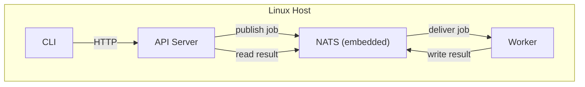
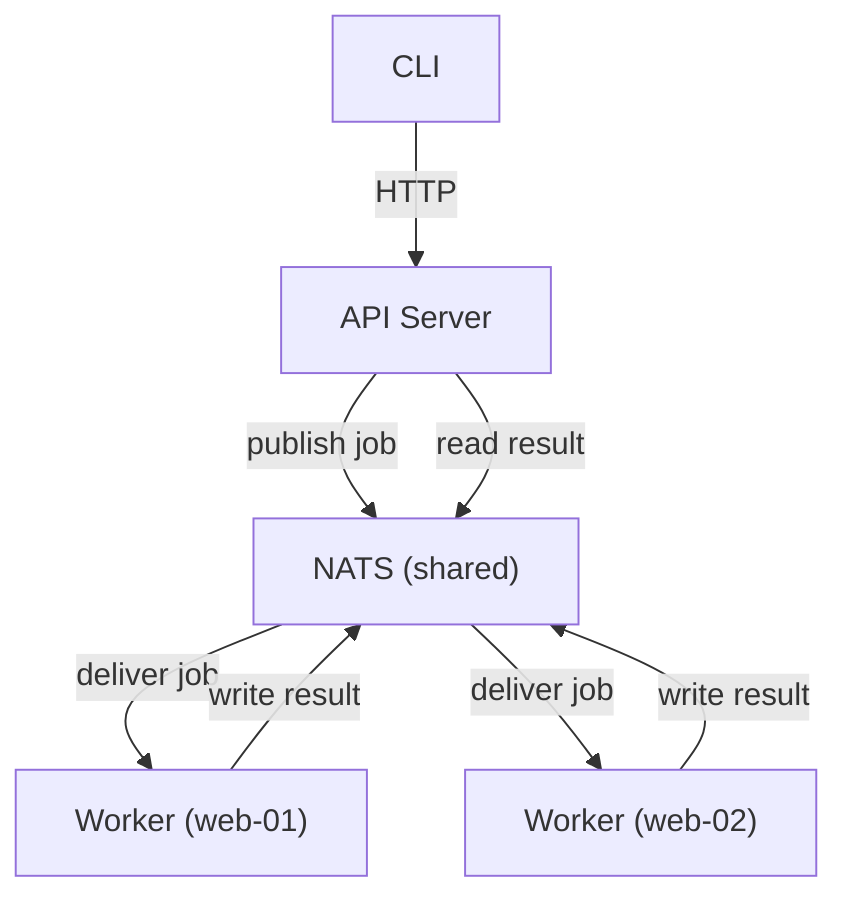
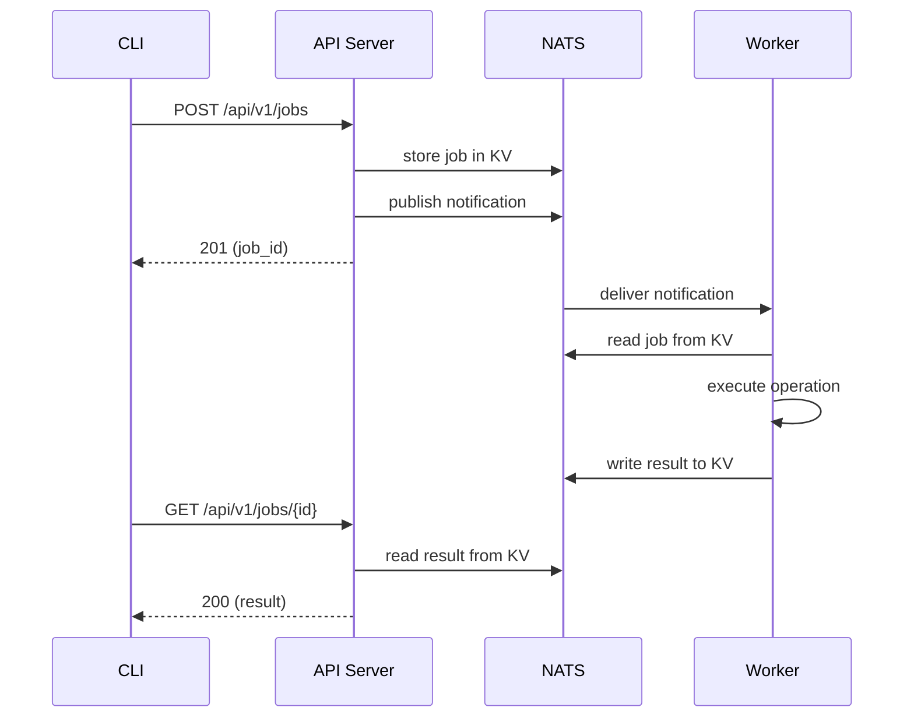

# Architecture

OSAPI turns Linux servers into managed appliances. You install a single binary,
point it at a config file, and get a REST API and CLI for querying and changing
system configuration — hostname, DNS, disk usage, memory, load averages, and
more. State-changing operations run asynchronously through a job queue so the
API server itself never needs root privileges.

## The Three Processes

OSAPI has three runtime components. They can all run on the same host or be
spread across many.

### NATS Server

A lightweight message broker that stores job state and routes messages between
the API server and workers. OSAPI embeds a NATS server with JetStream enabled,
so you don't need to install anything extra — just run
`osapi nats server start`.

For production deployments with multiple hosts, you can point everything at an
external NATS cluster instead of the embedded one. Just change the `nats.server`
section in `osapi.yaml`.

### API Server

An HTTP server that exposes a REST API. It handles authentication (JWT),
validates requests, and translates them into jobs that get published to NATS.
The API server never executes system commands directly — it creates a job and
returns a job ID. Clients poll for results.

Start it with `osapi api server start`.

### Worker

A background process that subscribes to NATS, picks up jobs, and executes the
actual system operations (reading hostname, querying DNS, checking disk usage,
etc.). Workers run with whatever privileges they have — if a worker can't read
something due to permissions, it reports the error rather than failing silently.

Start it with `osapi node agent start`.

## Deployment Models

### Single Host

The simplest setup. All three processes run on the same machine:

The CLI on the same host talks to the API server over localhost. This is useful
for managing a single appliance or for development.

### Multi-Host

For managing a fleet, run a shared NATS server (or cluster) and point multiple
workers at it. Each worker registers with its hostname and optional labels, and
the job routing system delivers work to the right place.

You can target jobs to specific hosts, broadcast to all, or route by label:

- `--target _any` — send to any available worker (load balanced)
- `--target _all` — send to every worker (broadcast)
- `--target web-01` — send to a specific host
- `--target group:web.dev` — send to all workers with a matching label

## How a Request Flows

When you run a command like `osapi client node hostname`:

The API server never touches the operating system directly. It's a thin
coordination layer between clients and workers.

## Further Reading

For details on individual features — what they do, how they work, and how to
configure them — see the Features section:

- [Node Management](../features/node-management.md) — hostname, disk, memory,
  load
- [Network Management](../features/network-management.md) — DNS, ping
- [Command Execution](../features/command-execution.md) — exec, shell
- [Job System](../features/job-system.md) — async job processing and routing
- [Audit Logging](../features/audit-logging.md) — API audit trail and export
- [Health Checks](../features/health-checks.md) — liveness, readiness, status
- [Authentication & RBAC](../features/authentication.md) — JWT, roles,
  permissions
- [Distributed Tracing](../features/distributed-tracing.md) — OpenTelemetry
  integration
- [Metrics](../features/metrics.md) — Prometheus endpoint

## Deep Dives

- [System Architecture](system-architecture.md) — package layout, handler
  structure, provider pattern, and code-level details
- [Job Architecture](job-architecture.md) — KV-first design, subject routing,
  worker pipeline, and multi-host processing
- [Configuration](../usage/configuration.md) — full `osapi.yaml` reference with
  every supported field
- [API Design Guidelines](api-guidelines.md) — REST conventions and endpoint
  patterns
- [Guiding Principles](principles.md) — design philosophy and project values
- [Development](../development/development.md) — setup, building, testing, and
  contributing
