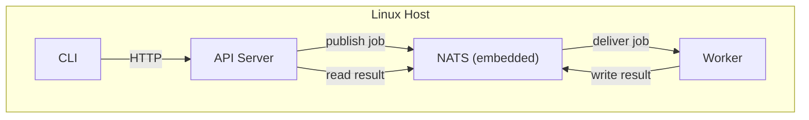
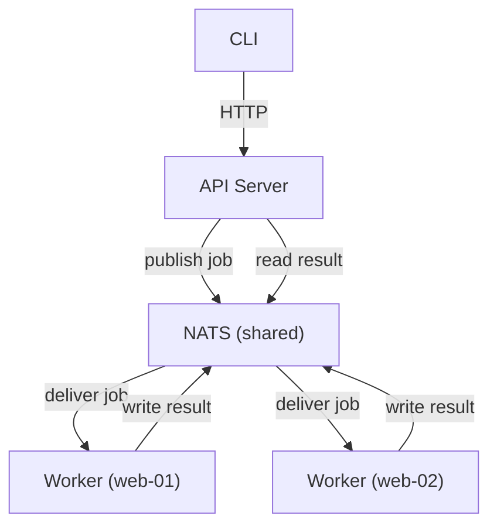
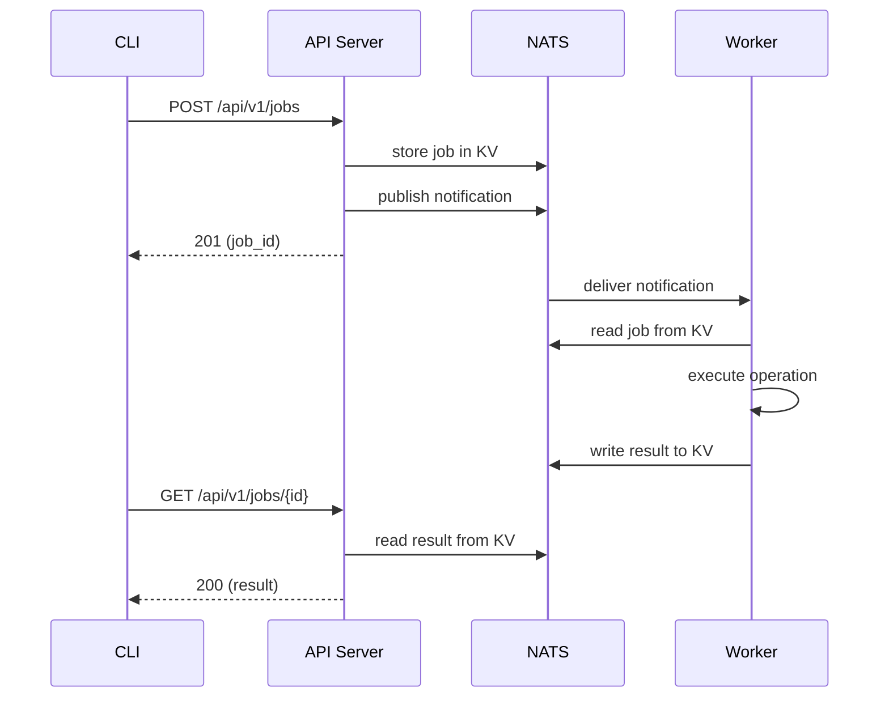

# Architecture

OSAPI turns Linux servers into managed appliances. You install a single binary,
point it at a config file, and get a REST API and CLI for querying and changing
system configuration — hostname, DNS, disk usage, memory, load averages, and
more. State-changing operations run asynchronously through a job queue so the
API server itself never needs root privileges.

## The Three Processes

OSAPI has three runtime components. They can all run on the same host or be
spread across many.

### NATS Server

A lightweight message broker that stores job state and routes messages between
the API server and workers. OSAPI embeds a NATS server with JetStream enabled,
so you don't need to install anything extra — just run
`osapi nats server start`.

For production deployments with multiple hosts, you can point everything at an
external NATS cluster instead of the embedded one. Just change the `nats.server`
section in `osapi.yaml`.

### API Server

An HTTP server that exposes a REST API. It handles authentication (JWT),
validates requests, and translates them into jobs that get published to NATS.
The API server never executes system commands directly — it creates a job and
returns a job ID. Clients poll for results.

Start it with `osapi api server start`.

### Worker

A background process that subscribes to NATS, picks up jobs, and executes the
actual system operations (reading hostname, querying DNS, checking disk usage,
etc.). Workers run with whatever privileges they have — if a worker can't read
something due to permissions, it reports the error rather than failing silently.

Start it with `osapi job worker start`.

## Deployment Models

### Single Host

The simplest setup. All three processes run on the same machine:



The CLI on the same host talks to the API server over localhost. This is useful
for managing a single appliance or for development.

### Multi-Host

For managing a fleet, run a shared NATS server (or cluster) and point multiple
workers at it. Each worker registers with its hostname and optional labels, and
the job routing system delivers work to the right place.



You can target jobs to specific hosts, broadcast to all, or route by label:

- `--target _any` — send to any available worker (load balanced)
- `--target _all` — send to every worker (broadcast)
- `--target web-01` — send to a specific host
- `--target group:web.dev` — send to all workers with a matching label

## How a Request Flows

When you run a command like `osapi client system hostname`:



The API server never touches the operating system directly. It's a thin
coordination layer between clients and workers.

## What It Can Do Today

| Domain  | Operations                                                 |
| ------- | ---------------------------------------------------------- |
| System  | Hostname, uptime, OS info, disk, memory, load              |
| Network | DNS configuration (get/update), ping                       |
| Jobs    | Create, list, get, delete, retry, queue stats, worker list |
| Health  | Liveness, readiness, system status with metrics            |
| Metrics | Prometheus endpoint (`/metrics`)                           |

## Health Checks

The API server exposes health endpoints for load balancers and monitoring:

- `/health` — is the process alive? (always returns 200)
- `/health/ready` — can it serve traffic? (checks NATS and KV connectivity)
- `/health/status` — per-component status with system metrics (requires auth)

## Distributed Tracing

OSAPI uses [OpenTelemetry](https://opentelemetry.io/) to propagate a single
trace ID through every component in a request flow. When tracing is enabled, you
can follow a request from CLI to API server to worker by filtering logs on
`trace_id`.

### How It Works

```
CLI ──[traceparent HTTP header]──> API Server ──[traceparent NATS header]──> Worker
```

1. **CLI** creates a root span and injects `traceparent` into the HTTP request
2. **API Server** continues the trace via `otelecho` middleware, then the
   nats-client automatically injects trace context into NATS message headers
   when publishing job notifications
3. **Worker** extracts trace context from the NATS message headers and creates a
   `job.process` span, linking its work to the original request

All structured log lines include `trace_id` and `span_id` when a span is active,
so `grep trace_id=<hex>` shows the complete end-to-end flow.

### Enabling Tracing

Tracing is off by default. Enable it in `osapi.yaml`:

```yaml
telemetry:
  tracing:
    enabled: true
    exporter: stdout # or "otlp" for production backends
```

The `--debug` flag auto-enables stdout tracing with no extra configuration.

For production, use the OTLP exporter to send traces to Jaeger, Tempo, or any
OTel-compatible backend:

```yaml
telemetry:
  tracing:
    enabled: true
    exporter: otlp
    otlp_endpoint: localhost:4317
```

### Debugging with Traces

To trace a request end-to-end:

1. Run all three processes with `--debug` (or `telemetry.tracing.enabled: true`)
2. Execute a command: `osapi client system hostname`
3. Find the `trace_id` in any component's log output
4. Filter all logs: `grep trace_id=<hex>` across API server and worker output

Example log output showing the same trace ID across components:

```
# API Server
INF publishing job request  job_id=abc123 trace_id=e0fd287f... span_id=1a2b3c...
INF received job response   job_id=abc123 trace_id=e0fd287f... span_id=1a2b3c...

# Worker
INF processing job          job_id=abc123 trace_id=e0fd287f... span_id=4d5e6f...
INF job processing completed job_id=abc123 trace_id=e0fd287f... span_id=4d5e6f...
```

## Security

All API endpoints (except health probes) require a JWT bearer token. Tokens
carry a role (`admin`, `write`, or `read`) that determines what the caller can
do. The API server validates tokens using a shared signing key.

## Further Reading

- [System Architecture](system-architecture.md) — package layout, handler
  structure, provider pattern, and code-level details
- [Job Architecture](job-architecture.md) — KV-first design, subject routing,
  worker pipeline, and multi-host processing
- [Configuration](../configuration.md) — full `osapi.yaml` reference with every
  supported field
- [API Design Guidelines](../api-guidelines.md) — REST conventions and endpoint
  patterns
- [Development](../development.md) — setup, building, testing, and contributing
