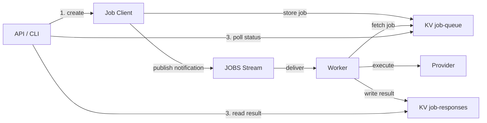
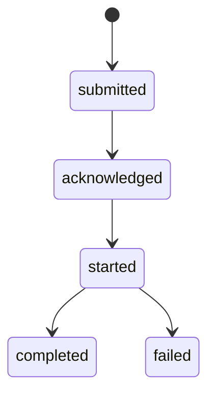
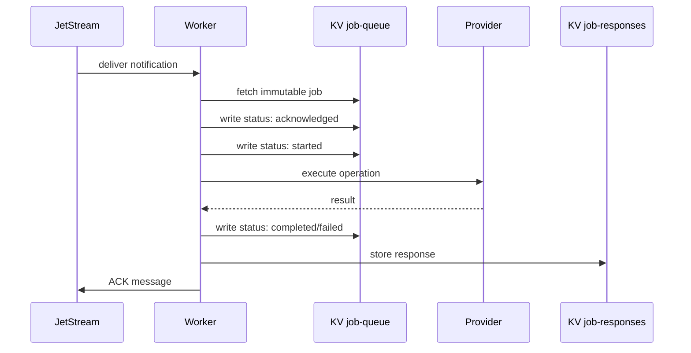

# Job System Architecture

**Date:** June 2025 **Status:** Implemented **Author:** @retr0h

## Overview

The OSAPI Job System implements a **KV-first, stream-notification architecture**
using NATS JetStream for distributed job processing. This system provides
asynchronous operation execution with persistent job state, intelligent worker
routing, and comprehensive job lifecycle management.

## Architecture Principles

- **KV-First Storage**: Job state lives in NATS KV for persistence and direct
  access
- **Stream Notifications**: Workers receive job notifications via JetStream
  subjects
- **Hierarchical Routing**: Operations use dot-notation for intelligent worker
  targeting
- **REST-Compatible**: Supports standard HTTP polling patterns for API
  integration
- **CLI Management**: Direct job queue inspection and management tools

## System Components

### Core Components

The system has three entry points that all funnel through a shared client layer
into NATS JetStream:

- **REST API** — Creates jobs, queries status, returns results
- **Jobs CLI** — Adds jobs, lists/inspects queue, monitors status
- **Job Workers** — Processes jobs, updates status, stores results

All three use the **Job Client Layer** (`internal/job/client/`), which provides
type-safe business logic operations (`CreateJob`, `GetQueueStats`,
`GetJobStatus`, `ListJobs`) on top of NATS JetStream.

**NATS JetStream** provides three storage backends:

| Store              | Purpose                                                     |
| ------------------ | ----------------------------------------------------------- |
| KV `job-queue`     | Job persistence (immutable job definitions + status events) |
| Stream `JOBS`      | Worker notifications (subject-routed job IDs)               |
| KV `job-responses` | Result storage (worker responses keyed by request ID)       |

### Job Flow



1. **Job Creation** — API/CLI calls Job Client, which stores the job in KV and
   publishes a notification to the stream
2. **Job Processing** — Worker receives notification from the stream, fetches
   the immutable job from KV, writes status events, executes the operation, and
   stores the result in KV
3. **Status Query** — API/CLI reads computed status from KV events

## NATS Configuration

### KV Buckets

1. **job-queue**: Primary job storage

   - Key format: `{status}.{uuid}`
   - Status prefixes: `unprocessed`, `processing`, `completed`, `failed`
   - TTL: 24 hours for completed/failed jobs
   - History: 5 versions

2. **job-responses**: Result storage
   - Key format: `{sanitized_job_id}`
   - TTL: 24 hours
   - Used for worker-to-client result passing

### JetStream Configuration

```yaml
Stream: JOBS
Subjects:
  - jobs.query.> # Read operations
  - jobs.modify.> # Write operations

Consumer: jobs-worker
Durable: true
AckPolicy: Explicit
MaxDeliver: 3
AckWait: 30s
```

## Subject Hierarchy

The system uses structured subjects for efficient routing:

```
jobs.{type}.{routing_type}.{value...}

Examples:
- jobs.query._any                  — load-balanced
- jobs.query._all                  — broadcast all
- jobs.query.host.server1          — direct to host
- jobs.query.label.group.web       — label group (role level)
- jobs.query.label.group.web.dev   — label group (role+env level)
- jobs.modify._all                 — broadcast modify
- jobs.modify.label.group.web      — label group modify
```

### Semantic Routing Rules

Operations are automatically routed to query or modify subjects based on their
type suffix:

- **Query operations** (read-only) → `jobs.query.{target}`:

  - `.get` - Retrieve current state
  - `.query` - Query information
  - `.read` - Read configuration
  - `.status` - Get status information
  - `.do` - Perform read-only actions (e.g., ping)
  - `system.*` - All system operations are read-only

- **Modify operations** (state-changing) → `jobs.modify.{target}`:
  - `.update` - Update configuration
  - `.set` - Set new values
  - `.create` - Create resources
  - `.delete` - Remove resources
  - `.execute` - Execute commands

The operation details (category, operation, data) are specified in the JSON
payload, not the subject.

### Target Types

- `_any`: Route to any available worker (load-balanced via queue group)
- `_all`: Route to all workers (broadcast)
- `{hostname}`: Route to a specific worker (e.g., `server1`)
- `{key}:{value}`: Route to all workers with a matching label (e.g.,
  `group:web`). Label targets use broadcast semantics — all matching workers
  receive the message. Values can be hierarchical with dot separators for prefix
  matching (e.g., `group:web.dev`).

### Label-Based Routing

Workers can be configured with hierarchical labels for group targeting. Label
values use dot-separated segments, and workers automatically subscribe to every
prefix level:

```yaml
job:
  worker:
    hostname: web-01
    labels:
      group: web.dev.us-east
```

A worker with the above config subscribes to these NATS subjects:

```
jobs.*.host.web-01                     — direct
jobs.*._any                            — load-balanced (queue group)
jobs.*._all                            — broadcast
jobs.*.label.group.web                 — prefix: role level
jobs.*.label.group.web.dev             — prefix: role+env level
jobs.*.label.group.web.dev.us-east     — prefix: exact match
```

Targeting examples:

```bash
--target group:web                  # all web servers
--target group:web.dev              # all web servers in dev
--target group:web.dev.us-east      # exact match
```

The dimension order in the label value determines the targeting hierarchy. Place
the most commonly targeted broad dimension first (e.g., role before env before
region). Label subscriptions have **no queue group** — all matching workers
receive the message (broadcast within the label group). Label keys must match
`[a-zA-Z0-9_-]+`, and each dot-separated segment of the value must match the
same pattern.

## Supported Operations

### System Operations (Query)

All system operations are routed to `jobs.query.*` subjects:

- **`system.hostname.get`** - Get system hostname
- **`system.status.get`** - Get comprehensive system status (all providers)
- **`system.uptime.get`** - Get system uptime
- **`system.os.get`** - Get operating system information
- **`system.disk.get`** - Get disk usage statistics
- **`system.memory.get`** - Get memory statistics
- **`system.load.get`** - Get load average statistics

### Network Operations

**Query/Action Operations** (`jobs.query.*`):

- **`network.dns.get`** - Get DNS configuration for interface
- **`network.ping.do`** - Execute ping to target address

**Modify Operations** (`jobs.modify.*`):

- **`network.dns.update`** - Update DNS servers and search domains

### Provider Mapping

- **System Host**: hostname, uptime, OS info
- **System Disk**: disk usage statistics
- **System Memory**: memory usage statistics
- **System Load**: load average statistics
- **Network DNS**: DNS configuration (get/update)
- **Network Ping**: ping execution and statistics

### Operation Type Definitions

```go
// System operations - read-only
const (
    OperationSystemHostnameGet = "system.hostname.get"
    OperationSystemStatusGet   = "system.status.get"
    OperationSystemUptimeGet   = "system.uptime.get"
    OperationSystemLoadGet     = "system.load.get"
    OperationSystemMemoryGet   = "system.memory.get"
    OperationSystemDiskGet     = "system.disk.get"
)

// Network operations
const (
    OperationNetworkDNSGet      = "network.dns.get"
    OperationNetworkDNSUpdate   = "network.dns.update"
    OperationNetworkPingExecute = "network.ping.execute"
)

// System operations - state-changing
const (
    OperationSystemShutdown = "system.shutdown.execute"
    OperationSystemReboot   = "system.reboot.execute"
)
```

## Job Lifecycle

### 1. Job Submission

```go
// Via API
POST /api/v1/jobs
{
  "operation": {
    "type": "network.dns.get",
    "data": {"interface": "eth0"}
  },
  "target_hostname": "_any"
}

// Via CLI
osapi client job add --json-file dns-query.json --target-hostname _any
```

### 2. Job States



**State Transitions via Events:**

- `submitted`: Job created by API/CLI
- `acknowledged`: Worker receives job notification
- `started`: Worker begins processing
- `completed`: Worker finishes successfully
- `failed`: Worker encounters error

**Multi-Worker States:**

- `processing`: One or more workers are active
- `partial_failure`: Some workers completed, others failed
- `completed`: All workers finished successfully
- `failed`: All workers failed

### 3. Job Polling

```go
// REST API polling
GET /api/v1/jobs/{job-id}

// Returns (computed from events)
{
  "id": "550e8400-e29b-41d4-a716-446655440000",
  "status": "completed",
  "created": "2024-01-10T10:00:00Z",
  "hostname": "worker-node-1",
  "updated_at": "2024-01-10T10:05:30Z",
  "operation": {...},
  "result": {...}
}

// For multi-worker jobs (_all targeting)
{
  "id": "550e8400-e29b-41d4-a716-446655440000",
  "status": "partial_failure",
  "created": "2024-01-10T10:00:00Z",
  "hostname": "worker-node-2", // Last responding worker
  "updated_at": "2024-01-10T10:05:45Z",
  "error": "disk full on worker-node-3",
  "operation": {...}
}
```

**Status is computed in real-time from:**

- Immutable job data (`jobs.{id}`)
- Status events (`status.{id}.*`)
- Worker responses (`responses.{id}.*`)

### Queue Statistics

```json
{
  "total_jobs": 42,
  "status_counts": {
    "unprocessed": 5,
    "processing": 2,
    "completed": 30,
    "failed": 5
  },
  "operation_counts": {
    "system.hostname.get": 15,
    "system.status.get": 19,
    "network.dns.get": 8,
    "network.ping.do": 23
  }
}
```

## Worker Implementation

### Processing Flow



### Append-Only Status Architecture

The job system uses an **append-only status log** to eliminate race conditions
and provide complete audit trails:

**Key Structure:**

```
jobs.{job-id}                               # Immutable job definition
status.{job-id}.{event}.{hostname}.{nano}   # Append-only status events
responses.{job-id}.{hostname}.{nano}        # Worker responses
```

**Status Event Timeline:**

```
status.abc123.submitted._api.1640995200         # Job created by API
status.abc123.acknowledged.server1.1640995201   # Server1 receives job
status.abc123.acknowledged.server2.1640995202   # Server2 receives job
status.abc123.started.server1.1640995205        # Server1 begins processing
status.abc123.started.server2.1640995207        # Server2 begins processing
status.abc123.completed.server1.1640995210      # Server1 finishes
status.abc123.failed.server2.1640995215         # Server2 fails
```

### Multi-Host Job Processing

The append-only architecture enables true broadcast job processing:

**For `_any` jobs** (load balancing):

- Multiple workers can acknowledge the job
- First to start wins, others see it's being processed
- Automatic failover if processing worker fails

**For `_all` jobs** (broadcast):

- All targeted workers process the same immutable job
- Each worker writes independent status events
- No race conditions or key conflicts
- Complete tracking of which hosts responded

**Status Computation:**

- Job status is computed from events in real-time
- Supports rich states: `submitted`, `processing`, `completed`, `failed`,
  `partial_failure`
- Client aggregates worker states to determine overall status

### Worker Subscription Patterns

Each worker creates JetStream consumers with these filter subjects:

- **Load-balanced** (queue group): `jobs.query._any`, `jobs.modify._any` — only
  one worker in the queue group processes each message
- **Direct**: `jobs.query.host.{hostname}`, `jobs.modify.host.{hostname}` —
  messages addressed to this specific worker
- **Broadcast**: `jobs.query._all`, `jobs.modify._all` — all workers receive the
  message (no queue group)
- **Label** (per prefix level, no queue group):
  `jobs.query.label.{key}.{prefix}`, `jobs.modify.label.{key}.{prefix}` — all
  workers matching the label prefix receive the message

### Provider Pattern

Workers use platform-specific providers:

```go
// Provider selection based on platform
switch platform {
case "ubuntu":
    provider = dns.NewUbuntuProvider()
default:
    provider = dns.NewLinuxProvider()
}
```

## Operation Examples

### System Operations

```json
// Get hostname
{
  "type": "system.hostname.get",
  "data": {}
}

// Get system status
{
  "type": "system.status.get",
  "data": {}
}

// Get uptime
{
  "type": "system.uptime.get",
  "data": {}
}
```

### Network Operations

```json
// Query DNS configuration
{
  "type": "network.dns.get",
  "data": {"interface": "eth0"}
}

// Update DNS servers
{
  "type": "network.dns.update",
  "data": {
    "servers": ["8.8.8.8", "1.1.1.1"],
    "interface": "eth0"
  }
}

// Execute ping
{
  "type": "network.ping.do",
  "data": {
    "address": "google.com"
  }
}
```

## REST API Integration

### Job Creation Endpoint

```http
POST /api/jobs
Content-Type: application/json

{
  "type": "system.hostname.get",
  "data": {},
  "target_hostname": "_any"
}
```

**Response:**

```json
{
  "job_id": "uuid-12345",
  "status": "created",
  "revision": 1
}
```

### Job Retry Endpoint

```http
POST /api/jobs/{job_id}/retry
Content-Type: application/json

{
  "target_hostname": "_any"
}
```

**Response:**

```json
{
  "job_id": "uuid-67890",
  "status": "created",
  "revision": 1
}
```

### Job Status Endpoint

```http
GET /api/jobs/{job_id}
```

**Response (Processing):**

```json
{
  "job_id": "uuid-12345",
  "status": "processing",
  "created": "2025-06-14T10:00:00Z",
  "operation": {
    "type": "system.hostname.get",
    "data": {}
  }
}
```

**Response (Completed):**

```json
{
  "job_id": "uuid-12345",
  "status": "completed",
  "created": "2025-06-14T10:00:00Z",
  "operation": {
    "type": "system.hostname.get",
    "data": {}
  },
  "result": {
    "hostname": "server-01"
  }
}
```

## CLI Commands

### Job Management

```bash
# Add a job
osapi client job add --json-file operation.json --target-hostname _any

# List jobs
osapi client job list --status unprocessed --limit 10

# Get job details
osapi client job get --job-id 550e8400-e29b-41d4-a716-446655440000

# Run job and wait for completion
osapi client job run --json-file operation.json --timeout 60

# Monitor queue status
osapi client job status --poll-interval-seconds 5

# Delete a job
osapi client job delete --job-id uuid-12345

# Retry a failed/stuck job
osapi client job retry --job-id 550e8400-...
```

## Package Architecture

The `internal/job/` package contains shared domain types and two subpackages:

**Root (`internal/job/`):**

| File          | Purpose                                                                                  |
| ------------- | ---------------------------------------------------------------------------------------- |
| `types.go`    | Core domain types (Request, Response, QueuedJob, QueueStats, WorkerState, TimelineEvent) |
| `subjects.go` | Subject routing, target parsing, label validation                                        |
| `hostname.go` | Local hostname resolution and caching                                                    |
| `config.go`   | Configuration structures                                                                 |

**Client (`internal/job/client/`):**

| File        | Purpose                                          |
| ----------- | ------------------------------------------------ |
| `client.go` | Publish-and-wait/collect with KV + stream        |
| `query.go`  | Query operations (system status, hostname, etc.) |
| `modify.go` | Modify operations (DNS updates)                  |
| `jobs.go`   | CreateJob, RetryJob, GetJobStatus, GetQueueStats |
| `worker.go` | WriteStatusEvent, WriteJobResponse               |
| `types.go`  | Client-specific types and interfaces             |

**Worker (`internal/job/worker/`):**

| File           | Purpose                                         |
| -------------- | ----------------------------------------------- |
| `worker.go`    | Worker implementation and lifecycle management  |
| `server.go`    | Worker server (NATS connect, stream setup, run) |
| `consumer.go`  | JetStream consumer creation and subscription    |
| `handler.go`   | Job lifecycle handling with status events       |
| `processor.go` | Provider dispatch and execution                 |
| `factory.go`   | Worker creation                                 |
| `types.go`     | Worker-specific types and context               |

### Separation of Concerns

- **`internal/job/`**: Core domain types shared across all components
- **`internal/job/client/`**: High-level operations for API integration
- **`internal/job/worker/`**: Job processing and worker lifecycle management
- **No type duplication**: All packages use shared types from main job package

## Architectural Benefits

### Race Condition Elimination

**Previous Issues:**

- Multiple workers updating same job key simultaneously
- Status transitions conflicting between workers
- Response overwrites in multi-host scenarios
- Timing issues with job state management

**Solution:**

- **Immutable jobs**: Never modified after creation
- **Unique event keys**: Each event has nanosecond timestamp
- **Append-only writes**: No conflicts, ever
- **Computed status**: Derived from events, not stored

### Multi-Host Distributed Processing

**Supports True Broadcast:**

```bash
# Send DNS update to ALL servers
osapi client job add --target-hostname _all --json-file dns-update.json

# Results: Each server processes independently
# - server1: completed (2.1s)
# - server2: completed (1.8s)
# - server3: failed (disk full)
# Overall status: partial_failure
```

**Load Balancing with Failover:**

```bash
# Send to ANY available server
osapi client job add --target-hostname _any --json-file system-check.json

# Results: First available worker processes
# Automatic failover if worker fails
```

### Observability & Debugging

**Distributed Tracing:**

Every job carries an OpenTelemetry trace context through NATS message headers.
The nats-client `Publish` method automatically injects the W3C `traceparent`
header, and the worker extracts it to continue the trace. This means a single
`trace_id` follows a request from the API server through NATS to the worker.

Enable tracing with `--debug` or `telemetry.tracing.enabled: true`, then filter
logs by `trace_id` to see the complete flow of any job. See the
[Distributed Tracing](../features/distributed-tracing.md) for setup details.

**Complete Event Timeline:**

- See exactly when each worker received job
- Track processing duration per worker
- Identify bottlenecks and failures
- Historical audit trail for compliance

### Direct Worker Testing

```bash
# Start a worker
osapi worker start

# Worker will:
# - Connect to NATS
# - Subscribe to job streams
# - Process jobs based on platform capabilities
```

## Security Considerations

1. **Authentication**: NATS authentication via environment variables
2. **Authorization**: Subject-based permissions for workers
3. **Input Validation**: All job data validated before processing
4. **Result Sanitization**: Sensitive data filtered from responses

## Performance Optimizations

1. **Batch Operations**: Workers can fetch multiple jobs per poll
2. **Connection Pooling**: Reuse NATS connections
3. **KV Caching**: Local caching of frequently accessed jobs
4. **Stream Filtering**: Workers only receive relevant job types
5. **Efficient Filtering**: Status-based key prefixes enable fast queries

## Error Handling

1. **Retry Logic**: Failed jobs retry up to MaxDeliver times
2. **Dead Letter Queue**: Jobs failing after max retries
3. **Timeout Handling**: Jobs timeout after AckWait period
4. **Graceful Degradation**: Workers continue on provider errors

## Monitoring

Key metrics to track:

- Queue depth by status
- Job processing time
- Worker availability
- DLQ message count
- Stream consumer lag

## Migration Path

1. **Phase 1**: Deploy job system alongside existing task system _(Complete)_
2. **Phase 2**: Implement job client abstraction layer _(Complete)_
3. **Phase 3**: Integrate job client into REST API _(Complete)_
4. **Phase 4**: Migrate all endpoints to strict-server + job client _(Complete)_
5. **Phase 5**: Delete legacy task system _(Complete)_
6. **Phase 6**: Consistency pass and test coverage audit _(Complete)_

## Future Enhancements

1. **Job Dependencies**: Chain multiple operations
2. **Scheduled Jobs**: Cron-like job scheduling
3. **Job Priorities**: High/medium/low priority queues
4. **Result Streaming**: Stream large results via NATS
5. **Worker Autoscaling**: Dynamic worker pool sizing
6. **Job Cancellation**: Ability to cancel running jobs
