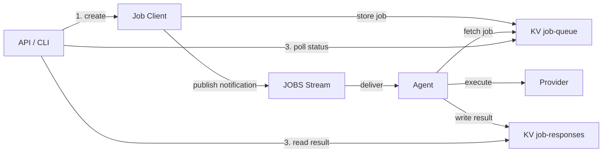
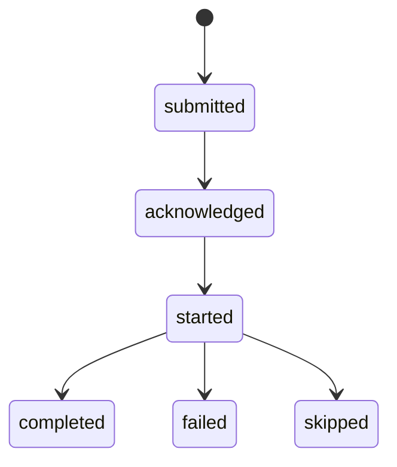
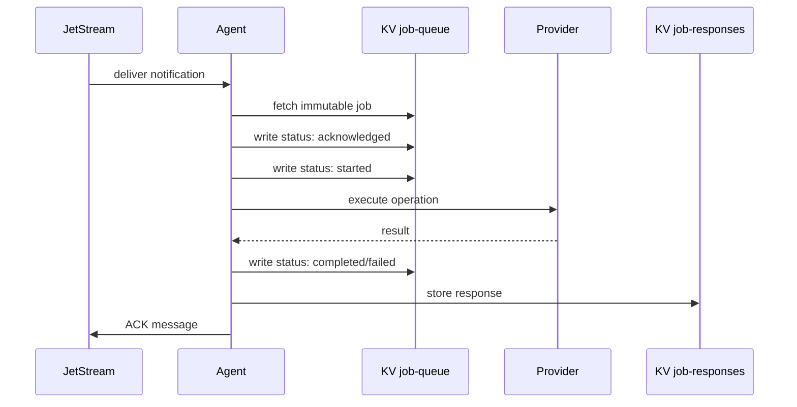

# Job System Architecture

**Date:** June 2025 **Status:** Implemented **Author:** @retr0h

## Overview

The OSAPI Job System implements a **KV-first, stream-notification architecture**
using NATS JetStream for distributed job processing. This system provides
asynchronous operation execution with persistent job state, intelligent agent
routing, and comprehensive job lifecycle management.

## Architecture Principles

- **KV-First Storage**: Job state lives in NATS KV for persistence and direct
  access
- **Stream Notifications**: Agents receive job notifications via JetStream
  subjects
- **Hierarchical Routing**: Operations use dot-notation for intelligent agent
  targeting
- **REST-Compatible**: Supports standard HTTP polling patterns for API
  integration
- **CLI Management**: Direct job queue inspection and management tools

## System Components

### Core Components

The system has three entry points that all funnel through a shared client layer
into NATS JetStream:

- **REST API** — Creates jobs via domain endpoints, queries status, returns
  results
- **Jobs CLI** — Lists/inspects queue, monitors status, retries jobs
- **Agents** — Processes jobs, updates status, stores results

All three use the **Job Client Layer** (`internal/job/client/`), which provides
type-safe business logic operations (`CreateJob`, `GetJobStatus`, `ListJobs`) on
top of NATS JetStream.

**NATS JetStream** provides three storage backends:

| Store              | Purpose                                                     |
| ------------------ | ----------------------------------------------------------- |
| KV `job-queue`     | Job persistence (immutable job definitions + status events) |
| Stream `JOBS`      | Agent notifications (subject-routed job IDs)                |
| KV `job-responses` | Result storage (agent responses keyed by request ID)        |

### Job Flow


```mermaid
graph LR
    A["API / CLI"] -->|1. create| JC["Job Client"]
    JC -->|store job| KV["KV job-queue"]
    JC -->|publish notification| Stream["JOBS Stream"]
    Stream -->|deliver| Agent
    Agent -->|fetch job| KV
    Agent -->|execute| Provider
    Agent -->|write result| KVR["KV job-responses"]
    A -->|3. poll status| KV
    A -->|3. read result| KVR
```

1. **Job Creation** — API/CLI calls Job Client, which stores the job in KV and
   publishes a notification to the stream
2. **Job Processing** — Agent receives notification from the stream, fetches the
   immutable job from KV, writes status events, executes the operation, and
   stores the result in KV
3. **Status Query** — API/CLI reads computed status from KV events

## NATS Configuration

### KV Buckets

1. **job-queue**: Primary job storage

   - Key format: `{status}.{uuid}`
   - Status prefixes: `unprocessed`, `processing`, `completed`, `failed`
   - TTL: 24 hours for completed/failed jobs
   - History: 5 versions

2. **job-responses**: Result storage

   - Key format: `{sanitized_job_id}`
   - TTL: 24 hours
   - Used for agent-to-client result passing

3. **agent-facts**: System facts storage (see
   [Facts Collection](#facts-collection) below)
   - Key format: `{hostname}`
   - TTL: 5 minutes
   - Typed system facts gathered by agents independently from the job system

### JetStream Configuration

```yaml
Stream: JOBS
Subjects:
  - jobs.query.> # Read operations
  - jobs.modify.> # Write operations

Consumer: jobs-agent
Durable: true
AckPolicy: Explicit
MaxDeliver: 3
AckWait: 30s
```

## Subject Hierarchy

The system uses structured subjects for efficient routing:

```
jobs.{type}.{routing_type}.{value...}

Examples:
- jobs.query._any                  — load-balanced
- jobs.query._all                  — broadcast all
- jobs.query.host.a1b2c3d4         — direct to host (by machine ID)
- jobs.query.label.group.web       — label group (role level)
- jobs.query.label.group.web.dev   — label group (role+env level)
- jobs.modify._all                 — broadcast modify
- jobs.modify.label.group.web      — label group modify
```

### Semantic Routing Rules

Operations are automatically routed to query or modify subjects based on their
type suffix:

- **Query operations** (read-only) → `jobs.query.{target}`:

  - `.get` - Retrieve current state
  - `.query` - Query information
  - `.read` - Read configuration
  - `.status` - Get status information
  - `.do` - Perform read-only actions (e.g., ping)
  - `node.*` - All node operations are read-only

- **Modify operations** (state-changing) → `jobs.modify.{target}`:
  - `.update` - Update configuration
  - `.set` - Set new values
  - `.create` - Create resources
  - `.delete` - Remove resources
  - `.execute` - Execute commands

The operation details (category, operation, data) are specified in the JSON
payload, not the subject.

### Target Types

- `_any`: Route to any available agent (load-balanced via queue group)
- `_all`: Route to all agents (broadcast)
- `{hostname}`: Route to a specific agent (e.g., `server1`)
- `{key}:{value}`: Route to all agents with a matching label (e.g.,
  `group:web`). Label targets use broadcast semantics — all matching agents
  receive the message. Values can be hierarchical with dot separators for prefix
  matching (e.g., `group:web.dev`).

### Label-Based Routing

Agents can be configured with hierarchical labels for group targeting. Label
values use dot-separated segments, and agents automatically subscribe to every
prefix level:

```yaml
agent:
  hostname: web-01
  labels:
    group: web.dev.us-east
```

An agent with the above config subscribes to these NATS subjects:

```
jobs.*.host.web-01                     — direct
jobs.*._any                            — load-balanced (queue group)
jobs.*._all                            — broadcast
jobs.*.label.group.web                 — prefix: role level
jobs.*.label.group.web.dev             — prefix: role+env level
jobs.*.label.group.web.dev.us-east     — prefix: exact match
```

Targeting examples:

```bash
--target group:web                  # all web servers
--target group:web.dev              # all web servers in dev
--target group:web.dev.us-east      # exact match
```

The dimension order in the label value determines the targeting hierarchy. Place
the most commonly targeted broad dimension first (e.g., role before env before
region). Label subscriptions have **no queue group** — all matching agents
receive the message (broadcast within the label group). Label keys must match
`[a-zA-Z0-9_-]+`, and each dot-separated segment of the value must match the
same pattern.

### Label Limits

Agents support up to **5 labels**. Each label creates NATS JetStream consumers
for every prefix level of its hierarchical value (query + modify). For example,
one label `group: web.dev.us-east` creates 6 consumers (3 prefix levels × 2
operation types). With 5 labels averaging 3 levels each, an agent creates ~36
consumers total (30 label + 6 base).

At fleet scale (1000+ agents), use an external NATS cluster rather than the
embedded server to handle the consumer count efficiently.

## Supported Operations

Browse `internal/agent/processor_*.go` for the current operation list.
Operations follow naming conventions like `node.hostname.get`,
`network.dns.update`, `cron.create`, `sysctl.delete`, etc.

## Job Lifecycle

### 1. Job Submission

Jobs are created through typed domain endpoints rather than a generic job
creation API. Each domain operation (such as retrieving a node's hostname or
updating its DNS configuration) creates a job internally and returns the job ID.
This ensures type safety and proper validation at the API layer.

```bash
# Get hostname — creates a job internally, returns job_id
osapi client node hostname --target web-01

# Update DNS — creates a job internally, returns job_id
osapi client node network dns update --target web-01 \
    --interface eth0 --servers 8.8.8.8,1.1.1.1
```

### 2. Job States


```mermaid
stateDiagram-v2
    [*] --> submitted
    submitted --> acknowledged
    acknowledged --> started
    started --> completed
    started --> failed
    started --> skipped
```

**State Transitions via Events:**

- `submitted`: Job created by API/CLI
- `acknowledged`: Agent receives job notification
- `started`: Agent begins processing
- `completed`: Agent finishes successfully
- `failed`: Agent encounters error
- `skipped`: Operation not supported on this agent

**Multi-Agent States:**

- `processing`: One or more agents are active
- `partial_failure`: Some agents completed, others failed
- `completed`: All agents finished successfully
- `failed`: All agents failed
- `skipped`: All agents skipped the operation

### 3. Job Polling

```go
// REST API polling
GET /api/v1/jobs/{job-id}

// Returns (computed from events)
{
  "id": "550e8400-e29b-41d4-a716-446655440000",
  "status": "completed",
  "created": "2024-01-10T10:00:00Z",
  "hostname": "agent-node-1",
  "updated_at": "2024-01-10T10:05:30Z",
  "operation": {...},
  "result": {...}
}

// For multi-agent jobs (_all targeting)
{
  "id": "550e8400-e29b-41d4-a716-446655440000",
  "status": "partial_failure",
  "created": "2024-01-10T10:00:00Z",
  "hostname": "agent-node-2", // Last responding agent
  "updated_at": "2024-01-10T10:05:45Z",
  "error": "disk full on agent-node-3",
  "operation": {...}
}
```

**Status is computed in real-time from:**

- Immutable job data (`jobs.{id}`)
- Status events (`status.{id}.*`)
- Agent responses (`responses.{id}.*`)

## Agent Implementation

### Processing Flow


```mermaid
sequenceDiagram
    participant JS as JetStream
    participant Agent
    participant KV as KV job-queue
    participant Provider
    participant KVR as KV job-responses

    JS->>Agent: deliver notification
    Agent->>KV: fetch immutable job
    Agent->>KV: write status: acknowledged
    Agent->>KV: write status: started
    Agent->>Provider: execute operation
    Provider-->>Agent: result
    Agent->>KV: write status: completed/failed
    Agent->>KVR: store response
    Agent->>JS: ACK message
```

### Append-Only Status Architecture

The job system uses an **append-only status log** to eliminate race conditions
and provide complete audit trails:

**Key Structure:**

```
jobs.{job-id}                               # Immutable job definition
status.{job-id}.{event}.{hostname}.{nano}   # Append-only status events
responses.{job-id}.{hostname}.{nano}        # Agent responses
```

**Status Event Timeline:**

```
status.abc123.submitted._api.1640995200         # Job created by API
status.abc123.acknowledged.server1.1640995201   # server1 receives job
status.abc123.acknowledged.server2.1640995202   # server2 receives job
status.abc123.started.server1.1640995205        # Server1 begins processing
status.abc123.started.server2.1640995207        # Server2 begins processing
status.abc123.completed.server1.1640995210      # Server1 finishes
status.abc123.failed.server2.1640995215         # Server2 fails
```

### Multi-Host Job Processing

The append-only architecture enables true broadcast job processing:

**For `_any` jobs** (load balancing):

- Multiple agents can acknowledge the job
- First to start wins, others see it's being processed
- Automatic failover if processing agent fails

**For `_all` jobs** (broadcast):

- All targeted agents process the same immutable job
- Each agent writes independent status events
- No race conditions or key conflicts
- Complete tracking of which hosts responded
- Agents that do not respond within `job_timeout` appear in the result with
  `status: failed` and `error: "timeout: agent did not respond"`
- The controller returns partial results — responding agents are not blocked by
  unresponsive ones

**Status Computation:**

- Job status is computed from events in real-time
- Supports rich states: `submitted`, `processing`, `completed`, `failed`,
  `partial_failure`
- Client aggregates agent states to determine overall status

### Agent Subscription Patterns

Each agent creates JetStream consumers with these filter subjects:

- **Load-balanced** (queue group): `jobs.query._any`, `jobs.modify._any` — only
  one agent in the queue group processes each message
- **Direct**: `jobs.query.host.{hostname}`, `jobs.modify.host.{hostname}` —
  messages addressed to this specific agent
- **Broadcast**: `jobs.query._all`, `jobs.modify._all` — all agents receive the
  message (no queue group)
- **Label** (per prefix level, no queue group):
  `jobs.query.label.{key}.{prefix}`, `jobs.modify.label.{key}.{prefix}` — all
  agents matching the label prefix receive the message

### Facts Collection

Agents collect **system facts** independently from the job system. Facts are
typed system properties — architecture, kernel version, FQDN, CPU count, network
interfaces, routes, primary interface, service manager, and package manager —
gathered via providers on a 60-second interval.

Facts are stored in a dedicated `agent-facts` KV bucket with a 5-minute TTL,
separate from the `agent-registry` heartbeat bucket. This keeps the heartbeat
lightweight (status and metrics only) while facts carry richer, less frequently
changing data.

When the API serves an `AgentInfo` response for a single node or a list of
nodes, it merges data from both KV buckets — registry for status, labels, and
lightweight metrics, and facts for detailed system properties — into a single
unified response.

Facts also power **fact references** (`@fact.*`) in job parameters. When an
agent processes a job, it replaces `@fact.interface.primary`, `@fact.hostname`,
and other tokens with live values from its cached facts. See
[System Facts](../features/system-facts.md) for the full reference.

## CLI Commands

### Job Management

```bash
# List jobs
osapi client job list --status unprocessed --limit 10

# Get job details
osapi client job get --job-id 550e8400-e29b-41d4-a716-446655440000

# Delete a job
osapi client job delete --job-id uuid-12345

# Retry a failed/stuck job
osapi client job retry --job-id 550e8400-...
```

Jobs are created through domain-specific commands (e.g.,
`osapi client node hostname`, `osapi client node network dns update`) rather
than a generic `job add` command.

## Package Architecture

The `internal/job/` package contains shared domain types and two subpackages:

**Root (`internal/job/`):**

| File          | Purpose                                                                                 |
| ------------- | --------------------------------------------------------------------------------------- |
| `types.go`    | Core domain types (Request, Response, QueuedJob, QueueStats, AgentState, TimelineEvent) |
| `subjects.go` | Subject routing, target parsing, label validation                                       |
| `hostname.go` | Local hostname resolution and caching                                                   |
| `config.go`   | Configuration structures                                                                |

**Client (`internal/job/client/`):**

| File        | Purpose                                          |
| ----------- | ------------------------------------------------ |
| `client.go` | Publish-and-wait/collect with KV + stream        |
| `query.go`  | Query operations (system status, hostname, etc.) |
| `modify.go` | Modify operations (DNS updates)                  |
| `jobs.go`   | CreateJob, RetryJob, GetJobStatus, ListJobs      |
| `agent.go`  | WriteStatusEvent, WriteJobResponse               |
| `types.go`  | Client-specific types and interfaces             |

**Agent (`internal/agent/`):**

| File           | Purpose                                        |
| -------------- | ---------------------------------------------- |
| `agent.go`     | Agent implementation and lifecycle management  |
| `server.go`    | Agent server (NATS connect, stream setup, run) |
| `consumer.go`  | JetStream consumer creation and subscription   |
| `handler.go`   | Job lifecycle handling with status events      |
| `processor.go` | Provider dispatch and execution                |
| `factory.go`   | Agent creation                                 |
| `types.go`     | Agent-specific types and context               |

### Separation of Concerns

- **`internal/job/`**: Core domain types shared across all components
- **`internal/job/client/`**: High-level operations for API integration
- **`internal/agent/`**: Job processing and agent lifecycle management
- **No type duplication**: All packages use shared types from main job package

## Security Considerations

1. **Authentication**: NATS authentication via environment variables
2. **Authorization**: Subject-based permissions for agents
3. **Input Validation**: All job data validated before processing
4. **Result Sanitization**: Sensitive data filtered from responses

## Performance Optimizations

### Two-Pass Job Listing

Job listing uses a two-pass approach to avoid reading every job payload:

**Pass 1 — Key-name scan (fast):** Calls `kv.Keys()` once to get all key names
in the bucket. Job status is derived purely from key name patterns
(`status.{id}.{event}.{hostname}.{ts}`) without any `kv.Get()` calls. This
produces ordered job IDs, per-job status, and aggregate status counts — all from
string parsing in memory.

**Pass 2 — Page fetch (bounded):** Fetches full job details (`kv.Get()`) only
for the paginated page. With `limit=10`, this is ~10 reads regardless of total
queue size.

```
Pass 1: kv.Keys() → 1 call → parse key names → status for all jobs
Pass 2: kv.Get()  → N calls → full details for page only (N = limit)
```

Queue statistics (`GetQueueSummary`) and the `ListJobs` status counts both use
Pass 1 only — no `kv.Get()` calls at all.

### Pagination Limits

The API enforces a maximum page size of 100 (`MaxPageSize`). Requests with
`limit=0` or `limit > 100` return 400. The default page size is 10.

### Known Scalability Constraint: `kv.Keys()`

The two-pass approach relies on `kv.Keys()`, which returns **all key names** in
the bucket as a string slice. NATS JetStream does not support paginated key
listing (`kv.Keys(prefix, limit, offset)`) — it is all or nothing.

This is acceptable today because:

- Key names are short strings (~80 bytes each)
- The KV bucket has a 1-hour TTL, naturally bounding the key count
- Even 100K keys as strings is only a few MB of memory

However, at very large scale (millions of keys or longer/no TTL), `kv.Keys()`
would become a bottleneck in both memory and latency. If this becomes a problem,
potential approaches include:

1. **Separate status index** — a dedicated KV key (e.g., `index.status.failed`)
   maintaining a list of job IDs, updated on status transitions
2. **External index** — move listing/filtering to a database (SQLite, Postgres)
   while keeping NATS for job dispatch and processing
3. **NATS KV watch** — use `kv.Watch()` to maintain an in-memory index
   incrementally rather than scanning all keys on each request

For now, the 1-hour TTL keeps the bucket bounded and `kv.Keys()` fast.

### Other Optimizations

1. **Batch Operations**: Agents can fetch multiple jobs per poll
2. **Connection Pooling**: Reuse NATS connections
3. **KV Caching**: Local caching of frequently accessed jobs
4. **Stream Filtering**: Agents only receive relevant job types

## Error Handling

1. **Retry Logic**: Failed jobs retry up to MaxDeliver times
2. **Dead Letter Queue**: Jobs failing after max retries
3. **Timeout Handling**: Jobs timeout after AckWait period
4. **Graceful Degradation**: Agents continue on provider errors

## Monitoring

Key metrics to track:

- Queue depth by status
- Job processing time
- Agent availability
- DLQ message count
- Stream consumer lag
