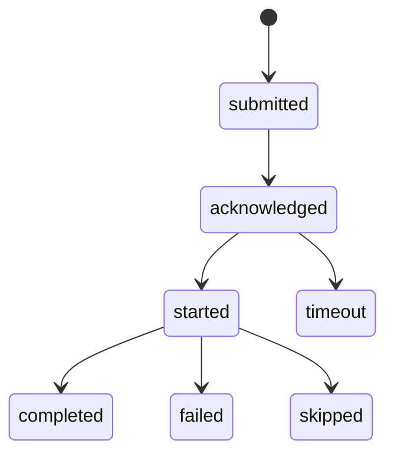

# Running Jobs

Every operation osapi performs on a host is a job: the CLI or the API creates
one, an agent runs it, and the result comes back through the job's own record.
This page is about running and watching them — submitting work, reading what a
status means, polling for a result, and what to monitor.

**How the system does it** — subjects and streams, the storage layout, delivery
guarantees, what a redelivery obliges an agent to do, and the deadlines that
bound an operation — is specified in the corpus rather than described here. A
contributor adding an operation wants that specification; an operator running
one wants this page.

## Targeting

### Target Types

- `_any`: Route to any available agent (load-balanced via queue group)
- `_all`: Route to all agents (broadcast)
- `{hostname}`: Route to a specific agent (e.g., `server1`)
- `{key}:{value}`: Route to all agents with a matching label (e.g.,
  `group:web`). Label targets use broadcast semantics — all matching agents
  receive the message. Values can be hierarchical with dot separators for prefix
  matching (e.g., `group:web.dev`).

### Label-Based Routing

Agents can be configured with hierarchical labels for group targeting. Label
values use dot-separated segments, and agents automatically subscribe to every
prefix level:

```yaml
agent:
  hostname: web-01
  labels:
    group: web.dev.us-east
```

An agent with the above config subscribes to these NATS subjects:

```
jobs.*.host.web-01                     — direct
jobs.*._any                            — load-balanced (queue group)
jobs.*._all                            — broadcast
jobs.*.label.group.web                 — prefix: role level
jobs.*.label.group.web.dev             — prefix: role+env level
jobs.*.label.group.web.dev.us-east     — prefix: exact match
```

Targeting examples:

```bash
--target group:web                  # all web servers
--target group:web.dev              # all web servers in dev
--target group:web.dev.us-east      # exact match
```

The dimension order in the label value determines the targeting hierarchy. Place
the most commonly targeted broad dimension first (e.g., role before env before
region). Label subscriptions have **no queue group** — all matching agents
receive the message (broadcast within the label group). Label keys must match
`[a-zA-Z0-9_-]+`, and each dot-separated segment of the value must match the
same pattern.

### Label Limits

Agents support up to **5 labels**. Each label creates NATS JetStream consumers
for every prefix level of its hierarchical value (query + modify). For example,
one label `group: web.dev.us-east` creates 6 consumers (3 prefix levels × 2
operation types). With 5 labels averaging 3 levels each, an agent creates ~36
consumers total (30 label + 6 base).

At fleet scale (1000+ agents), use an external NATS cluster rather than the
embedded server to handle the consumer count efficiently.

## Submitting Work

Jobs are created through typed domain endpoints rather than a generic job
creation API. Each domain operation (such as retrieving a node's hostname or
updating its DNS configuration) creates a job internally and returns the job ID.
This ensures type safety and proper validation at the API layer.

```bash
# Get hostname — creates a job internally, returns job_id
osapi client node hostname --target web-01

# Update DNS — creates a job internally, returns job_id
osapi client node network dns update --target web-01 \
    --interface eth0 --servers 8.8.8.8,1.1.1.1
```

## What a Status Means


```mermaid
stateDiagram-v2
    [*] --> submitted
    submitted --> acknowledged
    acknowledged --> started
    started --> completed
    started --> failed
    started --> skipped
    acknowledged --> timeout
```

**State Transitions via Events:**

- `submitted`: Job created by API/CLI
- `acknowledged`: Agent receives job notification
- `started`: Agent begins processing
- `completed`: Agent finishes successfully
- `failed`: Agent encounters error
- `skipped`: Operation not supported on this agent

**Multi-Agent States:**

- `processing`: One or more agents are active
- `partial_failure`: Some agents completed, others failed
- `completed`: All agents finished successfully
- `failed`: All agents failed
- `skipped`: All agents skipped the operation

**A host that never answers reports `timeout`**, not `failed`. The distinction
is the point: `failed` means the operation ran and did not succeed, while
`timeout` says nothing about whether it ran at all — the agent may be gone, or
it may be mid-`apt-get` and answering after the controller stopped waiting. An
operator has to go and look, which is a different next step from reading an
error.

A broadcast synthesizes one of these rows for each expected agent that did not
answer within `job_timeout`, carrying the error code `timeout` beside the
message. Per-host result rows across every domain use the same four values:
`ok`, `failed`, `skipped`, `timeout`.

## Polling for a Result

```go
// REST API polling
GET /api/v1/jobs/{job-id}

// Returns (computed from events)
{
  "id": "550e8400-e29b-41d4-a716-446655440000",
  "status": "completed",
  "created": "2024-01-10T10:00:00Z",
  "hostname": "agent-node-1",
  "updated_at": "2024-01-10T10:05:30Z",
  "operation": {...},
  "result": {...}
}

// For multi-agent jobs (_all targeting)
{
  "id": "550e8400-e29b-41d4-a716-446655440000",
  "status": "partial_failure",
  "created": "2024-01-10T10:00:00Z",
  "hostname": "agent-node-2", // Last responding agent
  "updated_at": "2024-01-10T10:05:45Z",
  "error": "disk full on agent-node-3",
  "operation": {...}
}
```

**Status is computed in real-time from:**

- Immutable job data (`jobs.{id}`)
- Status events (`status.{id}.*`)
- Agent responses (`responses.{id}.*`)

## CLI Commands

### Job Management

```bash
# List jobs
osapi client job list --status unprocessed --limit 10

# Get job details
osapi client job get --job-id 550e8400-e29b-41d4-a716-446655440000

# Delete a job
osapi client job delete --job-id uuid-12345

# Retry a failed/stuck job
osapi client job retry --job-id 550e8400-...
```

Jobs are created through domain-specific commands (e.g.,
`osapi client node hostname`, `osapi client node network dns update`) rather
than a generic `job add` command.

## Monitoring

Key metrics to track:

- Queue depth by status
- Job processing time
- Agent availability
- DLQ message count
- Stream consumer lag
