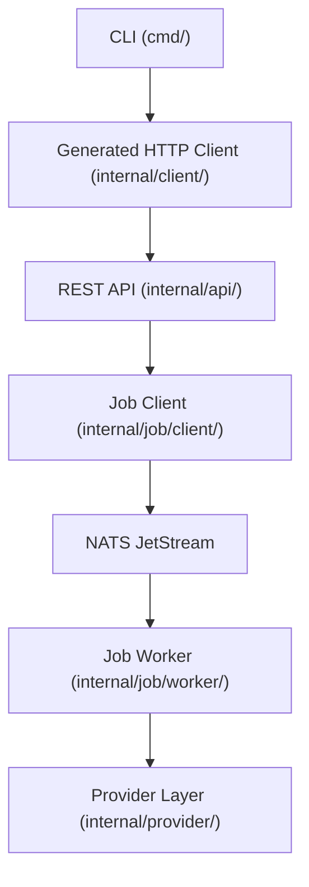
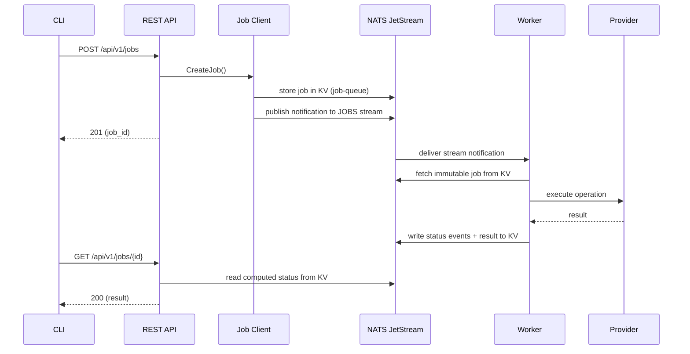

# System Architecture

OSAPI is a Linux system management platform that exposes a REST API for querying
and modifying host configuration and uses NATS JetStream for distributed,
asynchronous job processing. Operators interact with the system through a CLI
that can either hit the REST API directly or manage the job queue.

## Component Map

The system is organized into six layers, top to bottom:

| Layer                           | Package                                      | Role                                              |
| ------------------------------- | -------------------------------------------- | ------------------------------------------------- |
| **CLI**                         | `cmd/`                                       | Cobra command tree (thin wiring)                  |
| **Generated HTTP Client**       | `internal/client/`                           | OpenAPI-generated client used by CLI              |
| **REST API**                    | `internal/api/`                              | Echo server with JWT middleware                   |
| **Job Client**                  | `internal/job/client/`                       | Business logic for job CRUD and status            |
| **NATS JetStream**              | (external)                                   | KV `job-queue`, Stream `JOBS`, KV `job-responses` |
| **Job Worker / Provider Layer** | `internal/job/worker/`, `internal/provider/` | Consumes jobs from NATS and executes providers    |



The CLI talks to the REST API through the generated HTTP client. The REST API
delegates state-changing operations to the job client, which stores jobs in NATS
KV and publishes notifications to the JOBS stream. Workers pick up
notifications, execute the matching provider, and write results back to KV.

## Entry Points

The `osapi` binary exposes four top-level command groups:

- **`osapi api server start`** — starts the REST API server (Echo + JWT
  middleware)
- **`osapi job worker start`** — starts a job worker that subscribes to NATS
  subjects and processes operations
- **`osapi nats server start`** — starts an embedded NATS server with JetStream
  enabled
- **`osapi client`** — CLI client that talks to the REST API (system, network,
  job, and health subcommands)

## Layers

### CLI (`cmd/`)

The CLI is a [Cobra][] command tree. Each file maps to a single command (e.g.,
`client_job_add.go` implements `osapi client job add`). The CLI layer is thin
wiring: it parses flags, reads config via Viper, and delegates to the
appropriate internal package.

### REST API (`internal/api/`)

The API server is built on [Echo][] with handlers generated from an OpenAPI spec
via [oapi-codegen][] (`*.gen.go` files). Domain handlers are organized into
subpackages:

| Package                 | Responsibility                                                   |
| ----------------------- | ---------------------------------------------------------------- |
| `internal/api/system/`  | System endpoints (hostname, status, uptime, disk, memory, load)  |
| `internal/api/network/` | Network endpoints (DNS, ping)                                    |
| `internal/api/job/`     | Job queue endpoints (create, get, list, delete, status, workers) |
| `internal/api/health/`  | Health check endpoints (liveness, readiness, status)             |
| `internal/api/common/`  | Shared middleware, error handling, collection responses          |
| (metrics)               | Prometheus endpoint (`/metrics`) via OpenTelemetry               |

All state-changing operations are dispatched as jobs through the job client
layer rather than executed inline. Responses follow a uniform collection
envelope documented in the [API Design Guidelines](../api-guidelines.md).

### Job System (`internal/job/`)

The job system implements a **KV-first, stream-notification architecture** on
NATS JetStream. Core types live in `internal/job/`, with two subpackages:

| Package                | Purpose                                        |
| ---------------------- | ---------------------------------------------- |
| `internal/job/client/` | High-level operations (create, status, query)  |
| `internal/job/worker/` | Consumer pipeline (subscribe, handle, process) |

Subject routing uses dot-notation hierarchies (`jobs.query.*`, `jobs.modify.*`)
with support for load-balanced (`_any`), broadcast (`_all`), direct-host, and
label-based targeting.

For the full deep dive see [Job System Architecture](job-architecture.md).

### Provider Layer (`internal/provider/`)

Providers implement the actual system operations behind a common interface. Each
provider is selected at runtime through a platform-aware factory pattern.

| Domain         | Providers                      |
| -------------- | ------------------------------ |
| `system/host`  | Hostname, uptime, OS info      |
| `system/disk`  | Disk usage statistics          |
| `system/mem`   | Memory usage statistics        |
| `system/load`  | Load average statistics        |
| `network/dns`  | DNS configuration (get/update) |
| `network/ping` | Ping execution and statistics  |

Providers are stateless and platform-specific (e.g., a Ubuntu DNS provider vs. a
generic Linux DNS provider). Adding a new operation means implementing the
provider interface and registering it in the worker's processor dispatch.

### Configuration (`internal/config/`)

Configuration is managed by [Viper][] and loaded from an `osapi.yaml` file.
Environment variables override file values using the `OSAPI_` prefix with
underscore-separated keys (e.g., `OSAPI_API_SERVER_PORT`).

Minimal configuration skeleton (see [Configuration](../configuration.md) for the
full reference):

```yaml
api:
  client:
    url: 'http://localhost:8080'
    security:
      bearer_token: '<jwt>'
  server:
    port: 8080
    nats:
      host: 'localhost'
      port: 4222
      client_name: 'osapi-api'
    security:
      signing_key: '<secret>'
      cors:
        allow_origins: []

nats:
  server:
    host: '0.0.0.0'
    port: 4222
    store_dir: '/tmp/nats-store'

job:
  stream_name: 'JOBS'
  kv_bucket: 'job-queue'
  kv_response_bucket: 'job-responses'
  consumer_name: 'jobs-worker'
  worker:
    nats:
      host: 'localhost'
      port: 4222
      client_name: 'osapi-job-worker'
    hostname: 'worker-01'
    labels:
      group: 'web.dev'
```

## Health Checks (`internal/api/health/`)

The API server exposes three health check endpoints following the Kubernetes
liveness/readiness probe pattern. These endpoints live outside the `/api/v1/`
prefix at `/health` because they serve infrastructure concerns rather than
business operations.

| Endpoint             | Auth       | Purpose                                    |
| -------------------- | ---------- | ------------------------------------------ |
| `GET /health`        | None       | Liveness — returns 200 if the process runs |
| `GET /health/ready`  | None       | Readiness — verifies dependencies          |
| `GET /health/status` | JWT `read` | System status with metrics for operators   |

### Liveness (`/health`)

Returns `{"status":"ok"}` unconditionally. No dependency checks are performed.
If the HTTP server responds, the process is alive. This endpoint is deliberately
trivial — putting dependency checks here would cause orchestrators to restart
the process during a transient NATS outage, creating a restart storm on top of
the original problem.

### Readiness (`/health/ready`)

Runs all checks registered with the `Checker` interface and returns 200
(`ready`) or 503 (`not_ready`). The default checker (`NATSChecker`) verifies:

- **NATS connectivity** — the NATS connection is active and has a connected URL
- **KV bucket access** — the `job-queue` KV bucket is reachable and can list
  keys

Load balancers should use this endpoint to decide whether to route traffic. When
readiness fails, the server stays running but stops receiving requests until the
dependency recovers.

### Status (`/health/status`)

Breaks out each dependency as a named component with its own status and error
message. Also reports NATS connection info, JetStream stream statistics, KV
bucket statistics, job queue counts, application version, and uptime. Returns
`ok` when all components are healthy or `degraded` (with HTTP 503) when any
component fails. Requires JWT authentication because it exposes internal
topology.

Components checked:

| Component | What it checks                      |
| --------- | ----------------------------------- |
| `nats`    | NATS client is connected            |
| `kv`      | `job-queue` KV bucket is accessible |

Additional metrics (optional, gracefully skipped on failure):

| Section   | What it reports                                        |
| --------- | ------------------------------------------------------ |
| `nats`    | Connected URL, server version                          |
| `streams` | Message count, bytes, consumer count                   |
| `kv`      | Bucket name, key count, bytes                          |
| `jobs`    | Total, unprocessed, processing, completed, failed, DLQ |

### CLI Access

Operators can check health from the command line:

```bash
osapi client health              # liveness
osapi client health ready        # readiness
osapi client health status       # system status with metrics (requires auth)
```

## Request Flow

A typical operation (e.g., `system.hostname.get`) follows these steps:



## Security

### Authentication

The API uses **JWT HS256** tokens signed with a shared secret
(`security.signing_key`). Tokens carry a `role` claim that determines the
caller's access level. The `osapi token generate` command creates tokens for a
given role.

### Authorization

Access control is scope-based with a three-tier role hierarchy:

| Role    | Scopes                   |
| ------- | ------------------------ |
| `admin` | `read`, `write`, `admin` |
| `write` | `read`, `write`          |
| `read`  | `read`                   |

Each API endpoint declares a required scope. The JWT middleware checks that the
caller's role includes that scope before allowing the request. The health
endpoints `/health` and `/health/ready` are exceptions — they bypass JWT
authentication so that load balancers and orchestrators can probe them without
credentials.

### CORS

Cross-Origin Resource Sharing is configured per-server via
`api.server.security.cors.allow_origins` in `osapi.yaml`. An empty list disables
CORS headers entirely.

## External Dependencies

| Dependency                    | Purpose                                     |
| ----------------------------- | ------------------------------------------- |
| [Echo][]                      | HTTP framework for the REST API             |
| [Cobra][] / [Viper][]         | CLI framework and configuration             |
| [NATS][] / JetStream          | Messaging, KV store, stream processing      |
| [oapi-codegen][]              | OpenAPI strict-server code generation       |
| [OpenTelemetry][]             | Distributed tracing and Prometheus metrics  |
| [gopsutil][]                  | Cross-platform system metrics               |
| [pro-bing][]                  | ICMP ping implementation                    |
| [golang-jwt][]                | JWT creation and validation                 |
| `nats-client` / `nats-server` | Sibling repos (linked via `go.mod` replace) |

## Further Reading

- [Job System Architecture](job-architecture.md) — deep dive into the KV-first
  job system, subject routing, and worker pipeline
- [API Design Guidelines](../api-guidelines.md) — REST conventions, collection
  envelopes, and endpoint patterns
- [Guiding Principles](../principles.md) — design philosophy and project values
- [Development](../development.md) — setup, building, testing, and contributing

<!-- prettier-ignore-start -->
[Cobra]: https://github.com/spf13/cobra
[Echo]: https://echo.labstack.com
[Viper]: https://github.com/spf13/viper
[NATS]: https://nats.io
[oapi-codegen]: https://github.com/oapi-codegen/oapi-codegen
[gopsutil]: https://github.com/shirou/gopsutil
[pro-bing]: https://github.com/prometheus-community/pro-bing
[golang-jwt]: https://github.com/golang-jwt/jwt
[OpenTelemetry]: https://opentelemetry.io
<!-- prettier-ignore-end -->
