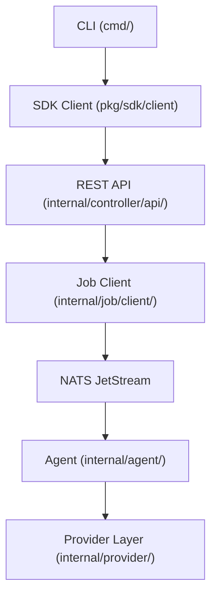
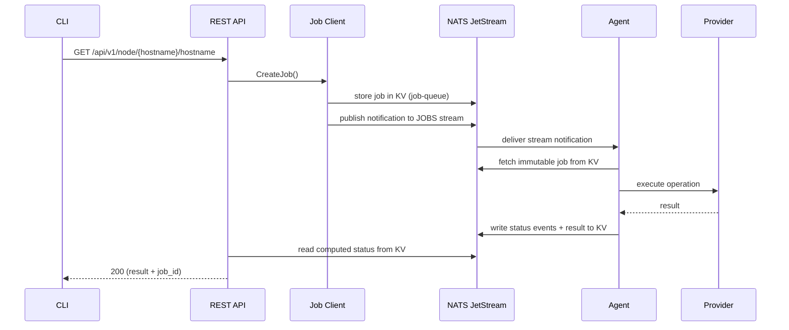

# System Architecture

OSAPI is a Linux system management platform that exposes a REST API for querying
and modifying host configuration and uses NATS JetStream for distributed,
asynchronous job processing. Operators interact with the system through a CLI
that can either hit the REST API directly or manage the job queue.

## Component Map

The system is organized into six layers, top to bottom:

| Layer                      | Package                                 | Role                                                                                     |
| -------------------------- | --------------------------------------- | ---------------------------------------------------------------------------------------- |
| **CLI**                    | `cmd/`                                  | Cobra command tree (thin wiring)                                                         |
| **SDK Client**             | `pkg/sdk/client`                        | OpenAPI-generated client used by CLI                                                     |
| **REST API**               | `internal/controller/api/`              | Echo server with JWT middleware                                                          |
| **Job Client**             | `internal/job/client/`                  | Business logic for job CRUD and status                                                   |
| **NATS JetStream**         | (external)                              | KV `job-queue`, Stream `JOBS`, KV `job-responses`, KV `agent-registry`                   |
| **Agent / Provider Layer** | `internal/agent/`, `internal/provider/` | Consumes jobs, executes providers, evaluates conditions, drain lifecycle, heartbeat      |
| **Notifications**          | `internal/notify/`                      | Watches registry KV for condition transitions; dispatches events via pluggable notifiers |


```mermaid
graph TD
    CLI["CLI (cmd/)"] --> SDK["SDK Client (pkg/sdk/client)"]
    SDK --> API["REST API (internal/controller/api/)"]
    API --> JobClient["Job Client (internal/job/client/)"]
    JobClient --> NATS["NATS JetStream"]
    NATS --> Agent["Agent (internal/agent/)"]
    Agent --> Provider["Provider Layer (internal/provider/)"]
```

The CLI talks to the REST API through the SDK client. The REST API delegates
state-changing operations to the job client, which stores jobs in NATS KV and
publishes notifications to the JOBS stream. Agents pick up notifications,
execute the matching provider, and write results back to KV.

## Entry Points

The `osapi` binary exposes four top-level command groups:

- **`osapi controller start`** — starts the REST controller (Echo + JWT
  middleware)
- **`osapi agent start`** — starts an agent that subscribes to NATS subjects and
  processes operations
- **`osapi nats server start`** — starts an embedded NATS server with JetStream
  enabled
- **`osapi client`** — CLI client that talks to the REST API (node, job, health,
  agent, and audit subcommands)

## Layers

### CLI (`cmd/`)

The CLI is a [Cobra][] command tree. Each file maps to a single command (e.g.,
`client_job_get.go` implements `osapi client job get`). The CLI layer is thin
wiring: it parses flags, reads config via Viper, and delegates to the
appropriate internal package.

### REST API (`internal/controller/api/`)

The controller is built on [Echo][] with handlers generated from an OpenAPI spec
via [oapi-codegen][] (`*.gen.go` files). Domain handlers are organized into
subpackages:

Browse `internal/controller/api/` for current domain handlers. Each domain has
its own subpackage with generated OpenAPI code, handler implementations, and
tests. Node-targeted domains live under `internal/controller/api/node/`,
controller-only domains are top-level (e.g., `job/`, `health/`, `audit/`).

All state-changing operations are dispatched as jobs through the job client
layer rather than executed inline. Responses follow a uniform collection
envelope documented in the [API Design Guidelines](api-guidelines.md).

### Job System (`internal/job/`)

The job system implements a **KV-first, stream-notification architecture** on
NATS JetStream. Core types live in `internal/job/`, with two subpackages:

| Package                | Purpose                                        |
| ---------------------- | ---------------------------------------------- |
| `internal/job/client/` | High-level operations (create, status, query)  |
| `internal/agent/`      | Consumer pipeline (subscribe, handle, process) |

Subject routing uses dot-notation hierarchies (`jobs.query.*`, `jobs.modify.*`)
with support for load-balanced (`_any`), broadcast (`_all`), direct-host, and
label-based targeting. The agent pipeline lives in `internal/agent/`.

For the full deep dive see [Job System Architecture](job-architecture.md).

### Provider Layer (`internal/provider/`)

Providers implement the actual system operations behind a common interface. Each
provider is selected at runtime through a platform-aware factory pattern.

Browse `internal/provider/` for current providers. Each domain has its own
subdirectory with platform-specific implementations (Debian, Darwin, Linux).

Providers are stateless and OS-family-specific. OSAPI follows Ansible's OS
family naming — the Debian family includes Ubuntu, Debian, and Raspbian. Darwin
(macOS) providers are also available for development. When a provider does not
support the current OS family, it returns `provider.ErrUnsupported` and the job
is marked as `skipped`. Adding a new operation means implementing the provider
interface and registering it in the agent's processor dispatch.

#### Meta Providers

Some providers don't write files directly — they delegate to the file provider.
These are called **meta providers**. The cron provider is the first example:
users upload a script to the Object Store, then `cron create` deploys it to the
correct path (`/etc/cron.d/` or `/etc/cron.{interval}/`) with the correct
permissions via the file provider's `Deploy()` method.

This gives meta providers SHA tracking, idempotency, drift detection, and Go
template rendering for free. The `file.Deployer` interface is the narrow
contract meta providers depend on:

```go
type Deployer interface {
    Deploy(ctx, DeployRequest) (*DeployResult, error)
    Undeploy(ctx, UndeployRequest) (*UndeployResult, error)
}
```

The pattern extends to providers like sysctl (which manages `/etc/sysctl.d/`
conf files), service (which manages systemd unit files in
`/etc/systemd/system/`), and certificate (which manages CA certificates in
`/usr/local/share/ca-certificates/`) — any provider that writes configuration
files to well-known paths.

#### Protected Objects

Objects in the NATS Object Store with the `osapi/` name prefix are protected
from user uploads and deletes (403). These are managed exclusively by the agent,
which seeds embedded templates on startup and updates them when a new osapi
version ships with changes. Meta providers reference these templates at deploy
time.

### Agent Lifecycle (`internal/agent/`)

All three runtime components — the controller, NATS server, and each agent —
heartbeat into a shared registry KV bucket (`agent-registry`) at regular
intervals. Each heartbeat record includes process metrics (CPU percent, RSS
bytes, goroutine count) collected by `internal/provider/process`. This gives
operators a unified view of component health via `/health/status`.

Agents additionally evaluate **node conditions** on each heartbeat tick (10s)
and support **graceful drain** for maintenance. Conditions are threshold-based
booleans (MemoryPressure, HighLoad, DiskPressure) computed from heartbeat
metrics.

The drain mechanism uses NATS consumer subscribe/unsubscribe. When an operator
drains an agent, the API writes a `drain.{hostname}` key to the state KV bucket
(`agent-state`, no TTL). The agent detects this on its next heartbeat,
unsubscribes from all NATS JetStream consumers (stopping new job delivery), and
transitions through `Draining` → `Cordoned` as in-flight jobs complete. Undrain
deletes the key and the agent resubscribes.

State transitions are recorded as append-only timeline events in the state KV
bucket, following the same pattern used for job lifecycle events. See
[Agent Lifecycle](../features/agent-lifecycle.md) for details.

### Configuration (`internal/config/`)

Configuration is managed by [Viper][] and loaded from an `osapi.yaml` file.
Environment variables override file values using the `OSAPI_` prefix with
underscore-separated keys (e.g., `OSAPI_API_SERVER_PORT`).

See [Configuration](../usage/configuration.md) for the full `osapi.yaml`
reference with every supported field.

## Health Checks (`internal/controller/api/health/`)

The controller exposes three health check endpoints following the Kubernetes
liveness/readiness probe pattern. Liveness and readiness probes are
unauthenticated and live outside the authenticated API surface because they
serve infrastructure concerns rather than business operations. The detailed
system status endpoint requires JWT authentication with the `health:read`
permission. See the [API reference](/category/api) for exact paths and response
schemas.

### Liveness

Returns `{"status":"ok"}` unconditionally. No dependency checks are performed.
If the HTTP server responds, the process is alive. This endpoint is deliberately
trivial — putting dependency checks here would cause orchestrators to restart
the process during a transient NATS outage, creating a restart storm on top of
the original problem.

### Readiness

Runs all checks registered with the `Checker` interface and returns 200
(`ready`) or 503 (`not_ready`). The default checker (`NATSChecker`) verifies:

- **NATS connectivity** — the NATS connection is active and has a connected URL
- **KV bucket access** — the `job-queue` KV bucket is reachable and can list
  keys

Load balancers should use this endpoint to decide whether to route traffic. When
readiness fails, the server stays running but stops receiving requests until the
dependency recovers.

### Status

Breaks out each dependency as a named component with its own status and error
message. Also reports NATS connection info, JetStream stream statistics, KV
bucket statistics, job queue counts, application version, and uptime. Returns
`ok` when all components are healthy or `degraded` (with HTTP 503) when any
component fails. Requires JWT authentication because it exposes internal
topology.

Components checked:

| Component | What it checks                      |
| --------- | ----------------------------------- |
| `nats`    | NATS client is connected            |
| `kv`      | `job-queue` KV bucket is accessible |

Additional metrics (optional, gracefully skipped on failure):

| Section   | What it reports                                        |
| --------- | ------------------------------------------------------ |
| `nats`    | Connected URL, server version                          |
| `streams` | Message count, bytes, consumer count                   |
| `kv`      | Bucket name, key count, bytes                          |
| `jobs`    | Total, unprocessed, processing, completed, failed, DLQ |

### CLI Access

Operators can check health from the command line:

```bash
osapi client health              # liveness
osapi client health ready        # readiness
osapi client health status       # system status with metrics (requires auth)
```

## Request Flow

A typical operation (e.g., getting the hostname) follows these steps:


```mermaid
sequenceDiagram
    participant CLI
    participant API as REST API
    participant JC as Job Client
    participant NATS as NATS JetStream
    participant Agent
    participant Provider

    CLI->>API: GET /api/v1/node/{hostname}/hostname
    API->>JC: CreateJob()
    JC->>NATS: store job in KV (job-queue)
    JC->>NATS: publish notification to JOBS stream
    NATS->>Agent: deliver stream notification
    Agent->>NATS: fetch immutable job from KV
    Agent->>Provider: execute operation
    Provider-->>Agent: result
    Agent->>NATS: write status events + result to KV
    API->>NATS: read computed status from KV
    API-->>CLI: 200 (result + job_id)
```

## Security

### Authentication

The API uses **JWT HS256** tokens signed with a shared secret
(`security.signing_key`). Tokens carry a `roles` claim (array) that determines
the caller's access level. The `osapi token generate` command creates tokens for
a given role. Tokens can also carry a `permissions` claim that overrides
role-based expansion.

### Authorization

Access control uses fine-grained `resource:verb` permissions. Each API endpoint
declares a required permission (e.g., `node:read`, `cron:write`,
`command:execute`). Built-in roles (`admin`, `write`, `read`) expand to default
permission sets, and custom roles can be defined in config. See
[Authentication & RBAC](../features/authentication.md) for the full permission
model.

The health endpoints `/health` and `/health/ready` are exceptions — they bypass
JWT authentication so that load balancers and orchestrators can probe them
without credentials.

### CORS

Cross-Origin Resource Sharing is configured per-server via
`controller.api.security.cors.allow_origins` in `osapi.yaml`. An empty list
disables CORS headers entirely.

## External Dependencies

| Dependency                    | Purpose                                     |
| ----------------------------- | ------------------------------------------- |
| [Echo][]                      | HTTP framework for the REST API             |
| [Cobra][] / [Viper][]         | CLI framework and configuration             |
| [NATS][] / JetStream          | Messaging, KV store, stream processing      |
| [oapi-codegen][]              | OpenAPI strict-server code generation       |
| [OpenTelemetry][]             | Distributed tracing and Prometheus metrics  |
| [gopsutil][]                  | Cross-platform system metrics               |
| [pro-bing][]                  | ICMP ping implementation                    |
| [golang-jwt][]                | JWT creation and validation                 |
| `nats-client` / `nats-server` | Sibling repos (linked via `go.mod` replace) |

## Further Reading

- [Job System Architecture](job-architecture.md) — deep dive into the KV-first
  job system, subject routing, and agent pipeline
- [API Design Guidelines](api-guidelines.md) — REST conventions, collection
  envelopes, and endpoint patterns
- [Guiding Principles](principles.md) — design philosophy and project values
- [Development](../development/development.md) — setup, building, testing, and
  contributing

<!-- prettier-ignore-start -->
[Cobra]: https://github.com/spf13/cobra
[Echo]: https://echo.labstack.com
[Viper]: https://github.com/spf13/viper
[NATS]: https://nats.io
[oapi-codegen]: https://github.com/oapi-codegen/oapi-codegen
[gopsutil]: https://github.com/shirou/gopsutil
[pro-bing]: https://github.com/prometheus-community/pro-bing
[golang-jwt]: https://github.com/golang-jwt/jwt
[OpenTelemetry]: https://opentelemetry.io
<!-- prettier-ignore-end -->
