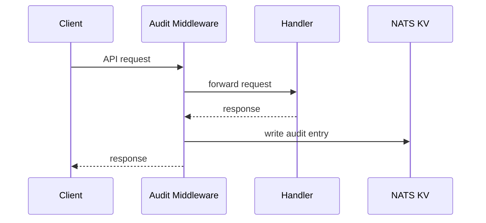

# Audit Logging

OSAPI records a structured audit trail of every API request. Audit entries
capture who made the request, what they did, and how long it took. This provides
accountability and supports compliance requirements.

## How It Works

The API server records audit entries automatically via middleware. Every
authenticated request generates an audit entry that is stored in a dedicated
NATS KV bucket. No application code needs to explicitly log audit events -- the
middleware handles it transparently.



Each audit entry contains:

| Field           | Description                             |
| --------------- | --------------------------------------- |
| `id`            | Unique entry identifier (UUID)          |
| `timestamp`     | When the request was made               |
| `user`          | Identity from the JWT `sub` claim       |
| `roles`         | Roles from the JWT token                |
| `method`        | HTTP method (`GET`, `POST`, etc.)       |
| `path`          | Request path (e.g., `/node/hostname`)   |
| `operation_id`  | OpenAPI operation ID (if available)     |
| `source_ip`     | Client IP address                       |
| `response_code` | HTTP response status code               |
| `duration_ms`   | Request processing time in milliseconds |

## Viewing Audit Logs

Query audit entries through the API or CLI. You can list recent entries
(paginated), get a specific entry by ID, or export all entries. See
[CLI Reference](../usage/cli/client/audit/audit.mdx) for usage and examples, or
the [API Reference](/gen/api/audit-log-api-audit) for the REST endpoints.

## Export

The export feature retrieves all audit entries and writes them to a local file
in JSONL format (one JSON object per line). This is designed for long-term
retention -- since audit entries in NATS KV have a configurable TTL (default 30
days), exporting preserves them before they expire.

The `GET /audit/export` endpoint returns all entries in a single response. The
CLI writes each entry as a JSON line to the output file. JSONL files are easy to
process with standard tools:

```bash
# Count entries
wc -l audit.jsonl

# Filter by user
grep '"user":"ops@example.com"' audit.jsonl

# Pretty-print with jq
cat audit.jsonl | jq .
```

## Retention

Audit entries are stored in a NATS KV bucket with configurable retention
settings. When entries exceed the TTL or the bucket reaches its size limit,
older entries are automatically removed. Export entries before they expire if
you need long-term retention.

## Configuration

```yaml
nats:
  audit:
    bucket: 'audit-log' # KV bucket name
    ttl: '720h' # 30-day retention (default)
    max_bytes: 52428800 # 50 MiB max bucket size
    storage: 'file' # "file" or "memory"
    replicas: 1 # Number of KV replicas
```

See [Configuration](../usage/configuration.md#natsaudit) for the full reference.

## Permissions

All audit endpoints require the `audit:read` permission. Only the `admin` role
includes this permission by default.

## Related

- [CLI Reference](../usage/cli/client/audit/audit.mdx) -- audit commands (list,
  get, export)
- [API Reference](/gen/api/audit-log-api-audit) -- REST API documentation
- [Configuration](../usage/configuration.md) -- full configuration reference
