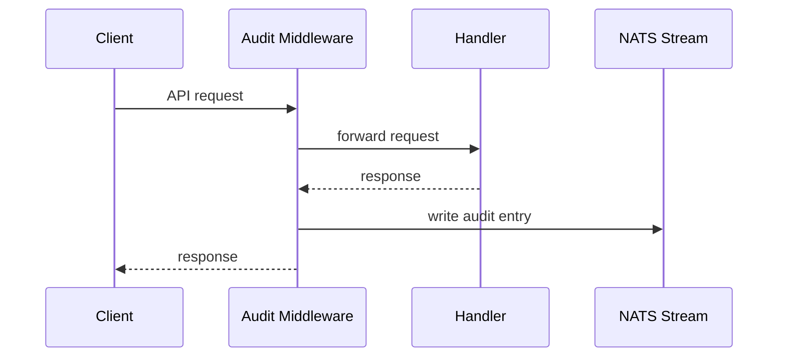

# Audit Logging

OSAPI records a structured audit trail of every API request. Audit entries
capture who made the request, what they did, and how long it took. This provides
accountability and supports compliance requirements.

## How It Works

The API server records audit entries automatically via middleware. Every
authenticated request generates an audit entry that is stored in a dedicated
NATS JetStream stream. No application code needs to explicitly log audit events
-- the middleware handles it transparently.


```mermaid
sequenceDiagram
    participant Client
    participant Middleware as Audit Middleware
    participant Handler
    participant Stream as NATS Stream

    Client->>Middleware: API request
    Middleware->>Handler: forward request
    Handler-->>Middleware: response
    Middleware->>Stream: write audit entry
    Middleware-->>Client: response
```

Each audit entry contains:

| Field             | Description                                      |
| ----------------- | ------------------------------------------------ |
| `id`              | Unique entry identifier (UUID)                   |
| `timestamp`       | When the request was made                        |
| `user`            | Identity from the JWT `sub` claim                |
| `roles`           | Roles from the JWT token                         |
| `method`          | HTTP method (`GET`, `POST`, etc.)                |
| `path`            | Request path (e.g., `/node/hostname`)            |
| `operation_id`    | OpenAPI operation ID (if available)              |
| `source_ip`       | Client IP address                                |
| `response_code`   | HTTP response status code                        |
| `duration_ms`     | Request processing time in milliseconds          |
| `trace_id`        | OpenTelemetry trace ID (when tracing is enabled) |
| `job_id`          | The job the request created, when it created one |
| `request_summary` | What the request asked for, redacted (see below) |

### What the request asked for

Who called `command/shell` against which host, without the command, is not an
answer to "what happened". For any method that changes something — `POST`,
`PUT`, `PATCH`, `DELETE` — the entry records `request_summary`: the request body
as JSON, with the values of sensitive fields replaced by `[redacted]`.

- **Redacted fields** are matched by name, case-insensitively, at every depth,
  so a password nested inside a list of users is redacted too: `password`,
  `password_hash`, `secret`, `token`, `private_key`, `key_data`, `stdin`,
  `content`, `authorization`.
- **The list is a deny list, not an allow list.** New fields are recorded by
  default, because a summary that only holds the fields somebody remembered
  answers nothing after an incident. A field carrying a secret is added to the
  list in the same change that adds the field.
- **A summary is capped** at 2 KB and marked `…[truncated]` when cut. A body
  over 64 KB is not read at all: the entry says so rather than holding an
  upload.
- **A body that is not JSON** is described — its content type and size — rather
  than stored.
- **A read records nothing**, since a `GET` carries nothing worth keeping.

`job_id` is what joins an entry to the job's own status timeline, so "who asked
for this" and "what the agents did about it" are one trail rather than two. A
request that creates no job has no `job_id`.

## Viewing Audit Logs

Query audit entries through the API or CLI. You can list recent entries
(paginated), get a specific entry by ID, or export all entries. See
[CLI Reference](../usage/cli/client/audit/audit.mdx) for usage and examples, or
the [API Reference](/gen/api/audit-log-api-audit) for the REST endpoints.

## Export

The export feature retrieves all audit entries and writes them to a local file
in JSONL format (one JSON object per line). This is designed for long-term
retention -- since audit entries in the NATS stream have a configurable
`max_age` (default 30 days), exporting preserves them before they expire.

The export endpoint returns all entries in a single response. The CLI writes
each entry as a JSON line to the output file. JSONL files are easy to process
with standard tools:

```bash
# Count entries
wc -l audit.jsonl

# Filter by user
grep '"user":"ops@example.com"' audit.jsonl

# Pretty-print with jq
cat audit.jsonl | jq .
```

## Retention

Audit entries are stored in a NATS JetStream stream with configurable retention
settings. When entries exceed the `max_age` or the stream reaches its size
limit, older entries are automatically removed. Export entries before they
expire if you need long-term retention.

## Configuration

```yaml
nats:
  audit:
    stream: 'AUDIT' # JetStream stream name
    subject: 'audit' # Base subject prefix
    max_age: '720h' # 30-day retention (default)
    max_bytes: 52428800 # 50 MiB max stream size
    storage: 'file' # "file" or "memory"
    replicas: 1 # Number of stream replicas
```

Each audit entry includes a `trace_id` field when distributed tracing is
enabled, allowing correlation with OpenTelemetry traces.

See [Configuration](../usage/configuration.md#natsaudit) for the full reference.

## Permissions

All audit endpoints require the `audit:read` permission. Only the `admin` role
includes this permission by default.

## Related

- [CLI Reference](../usage/cli/client/audit/audit.mdx) -- audit commands (list,
  get, export)
- [API Reference](/gen/api/audit-log-api-audit) -- REST API documentation
- [Configuration](../usage/configuration.md) -- full configuration reference
