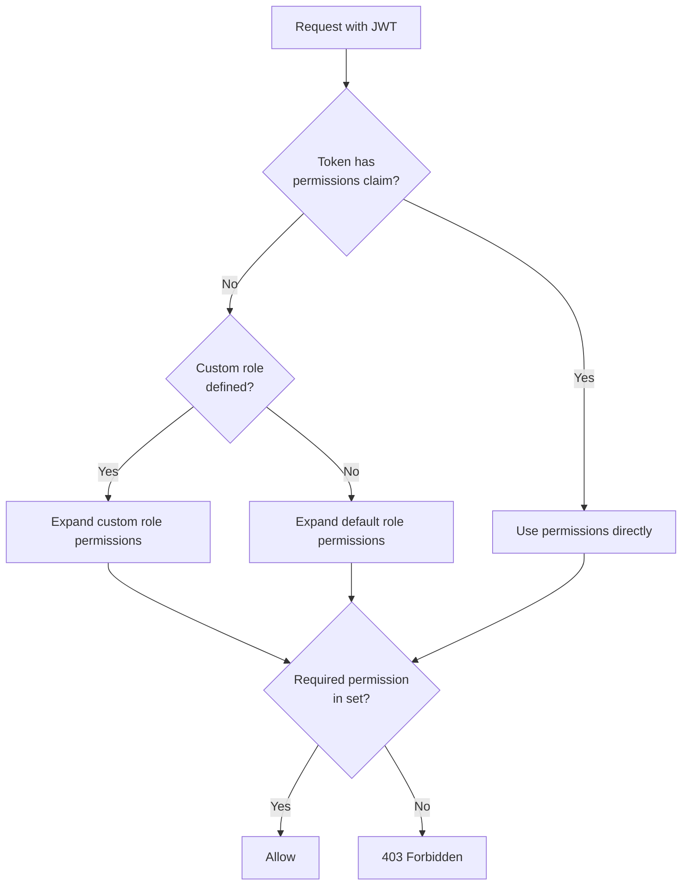

# Authentication & RBAC

OSAPI uses JWT bearer tokens for authentication and fine-grained `resource:verb`
permissions for authorization. Every API endpoint (except health probes)
requires a valid token.

## How It Works

### JWT Signing

OSAPI uses **HMAC-SHA256 (HS256)** symmetric signing. The same `signing_key` is
used to both create and verify tokens:

```
osapi token generate ──[signs with signing_key]──> JWT
Client ──[sends JWT]──> API Server ──[verifies with signing_key]──> Allow/Deny
```

Only someone who knows the signing key can create valid tokens. If the signing
key is compromised, rotate it immediately -- all previously issued tokens become
invalid.

### Token Structure

A token carries three pieces of authorization data:

- **Roles** (`roles` claim, required) -- one or more of `admin`, `write`, `read`
- **Permissions** (`permissions` claim, optional) -- direct `resource:verb`
  grants that override role expansion
- **Subject** (`sub` claim) -- user identity for audit logging

Generate tokens with the CLI. See [CLI Reference](../usage/cli/token/token.mdx)
for usage and examples, or the [API Reference](/category/api) for the REST
endpoints.

### Permission Resolution

When a request arrives, the middleware resolves the caller's effective
permissions:



## Roles and Permissions

Built-in roles expand to these default permissions:

| Role    | Permissions                                                                                        |
| ------- | -------------------------------------------------------------------------------------------------- |
| `admin` | `node:read`, `network:read`, `network:write`, `job:read`, `job:write`, `health:read`, `audit:read` |
| `write` | `node:read`, `network:read`, `network:write`, `job:read`, `job:write`, `health:read`               |
| `read`  | `node:read`, `network:read`, `job:read`, `health:read`                                             |

### Custom Roles

Define custom roles in the configuration to create new role names or override
default permission mappings:

```yaml
api:
  server:
    security:
      roles:
        ops:
          permissions:
            - node:read
            - health:read
        netadmin:
          permissions:
            - network:read
            - network:write
            - health:read
```

## Configuration

```yaml
api:
  server:
    security:
      # HS256 signing key (REQUIRED)
      # Generate with: openssl rand -hex 32
      signing_key: '<64-char hex string>'

  client:
    security:
      # JWT for client requests (REQUIRED)
      # Generate with: osapi token generate
      bearer_token: '<jwt>'
```

See [Configuration](../usage/configuration.md#permissions) for the full
reference including custom roles and CORS settings.

## Related

- [CLI Reference](../usage/cli/token/token.mdx) -- token generation and
  validation commands
- [API Reference](/category/api) -- REST API documentation
- [Configuration](../usage/configuration.md) -- full configuration reference
- [Architecture](../architecture/architecture.md) -- system design overview
