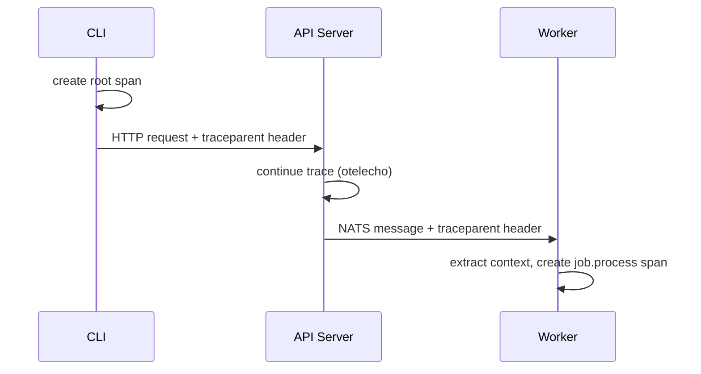

# Distributed Tracing

OSAPI uses [OpenTelemetry](https://opentelemetry.io/) to propagate a single
trace ID through every component in a request flow. When tracing is enabled, you
can follow a request from CLI to API server to worker by filtering logs on
`trace_id`.

## How It Works



1. **CLI** creates a root span and injects `traceparent` into the HTTP request
2. **API Server** continues the trace via `otelecho` middleware, then the
   nats-client automatically injects trace context into NATS message headers
   when publishing job notifications
3. **Worker** extracts trace context from the NATS message headers and creates a
   `job.process` span, linking its work to the original request

All structured log lines include `trace_id` and `span_id` when a span is active,
so `grep trace_id=<hex>` shows the complete end-to-end flow.

## Debugging with Traces

To trace a request end-to-end:

1. Run all three processes with `--debug` (or `telemetry.tracing.enabled: true`)
2. Execute a command: `osapi client node hostname`
3. Find the `trace_id` in any component's log output
4. Filter all logs: `grep trace_id=<hex>` across API server and worker output

Example log output showing the same trace ID across components:

```
# API Server
INF publishing job request  job_id=abc123 trace_id=e0fd287f... span_id=1a2b3c...
INF received job response   job_id=abc123 trace_id=e0fd287f... span_id=1a2b3c...

# Worker
INF processing job          job_id=abc123 trace_id=e0fd287f... span_id=4d5e6f...
INF job processing completed job_id=abc123 trace_id=e0fd287f... span_id=4d5e6f...
```

## Configuration

Tracing is off by default. The `exporter` field controls where spans are sent:

| `exporter` | Behavior                                                                                                                         |
| ---------- | -------------------------------------------------------------------------------------------------------------------------------- |
| _(unset)_  | Log correlation only -- `trace_id` appears in structured logs but no spans are exported                                          |
| `stdout`   | Raw OpenTelemetry span JSON dumped directly to stdout (bypasses the structured logger -- useful for one-off debugging but noisy) |
| `otlp`     | Spans sent via gRPC to a tracing backend (Jaeger, Tempo, etc.)                                                                   |

The `--debug` flag auto-enables tracing with **no exporter** (log correlation
only). It does not enable the `stdout` exporter.

### Log correlation (recommended default)

Enable tracing so `trace_id` and `span_id` appear in structured log lines. No
spans are exported -- you correlate requests by grepping logs.

```yaml
telemetry:
  tracing:
    enabled: true
```

### OTLP export (production)

Send spans to a self-hosted tracing backend like
[Jaeger](https://www.jaegertracing.io/) or
[Grafana Tempo](https://grafana.com/oss/tempo/). The `otlp_endpoint` is the gRPC
address of that backend.

```yaml
telemetry:
  tracing:
    enabled: true
    exporter: otlp
    otlp_endpoint: localhost:4317
```

:::note The OTLP exporter currently uses an insecure (non-TLS) gRPC connection
with no authentication. This works for local or internal backends but not for
cloud services (Grafana Cloud, Honeycomb, Datadog) that require TLS and API
keys. Authenticated OTLP is planned. :::

See [Configuration](../usage/configuration.md#telemetrytracing) for the full
reference.

## Related

- [Configuration](../usage/configuration.md) -- full configuration reference
- [Architecture](../architecture/architecture.md) -- system design overview
- [Job System](job-system.md) -- how async job processing works
