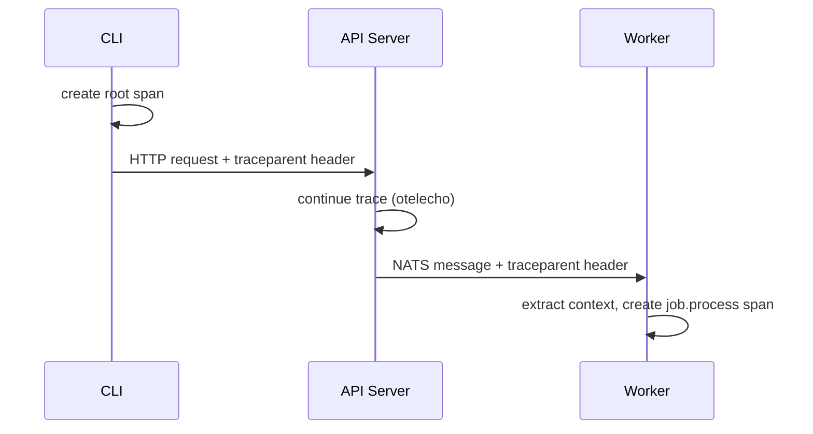

# Distributed Tracing

OSAPI uses [OpenTelemetry](https://opentelemetry.io/) to propagate a single
trace ID through every component in a request flow. When tracing is enabled, you
can follow a request from CLI to API server to worker by filtering logs on
`trace_id`.

## How It Works



1. **CLI** creates a root span and injects `traceparent` into the HTTP request
2. **API Server** continues the trace via `otelecho` middleware, then the
   nats-client automatically injects trace context into NATS message headers
   when publishing job notifications
3. **Worker** extracts trace context from the NATS message headers and creates a
   `job.process` span, linking its work to the original request

All structured log lines include `trace_id` and `span_id` when a span is active,
so `grep trace_id=<hex>` shows the complete end-to-end flow.

## Debugging with Traces

To trace a request end-to-end:

1. Run all three processes with `--debug` (or `telemetry.tracing.enabled: true`)
2. Execute a command: `osapi client system hostname`
3. Find the `trace_id` in any component's log output
4. Filter all logs: `grep trace_id=<hex>` across API server and worker output

Example log output showing the same trace ID across components:

```
# API Server
INF publishing job request  job_id=abc123 trace_id=e0fd287f... span_id=1a2b3c...
INF received job response   job_id=abc123 trace_id=e0fd287f... span_id=1a2b3c...

# Worker
INF processing job          job_id=abc123 trace_id=e0fd287f... span_id=4d5e6f...
INF job processing completed job_id=abc123 trace_id=e0fd287f... span_id=4d5e6f...
```

## Configuration

Tracing is off by default. Enable it in `osapi.yaml`:

```yaml
telemetry:
  tracing:
    enabled: true
    exporter: stdout # or "otlp" for production backends
```

The `--debug` flag auto-enables stdout tracing with no extra configuration.

For production, use the OTLP exporter to send traces to Jaeger, Tempo, or any
OTel-compatible backend:

```yaml
telemetry:
  tracing:
    enabled: true
    exporter: otlp
    otlp_endpoint: localhost:4317
```

See [Configuration](../usage/configuration.md#telemetrytracing) for the full
reference.

## Related

- [Configuration](../usage/configuration.md) -- full configuration reference
- [Architecture](../architecture/architecture.md) -- system design overview
- [Job System](job-system.md) -- how async job processing works
