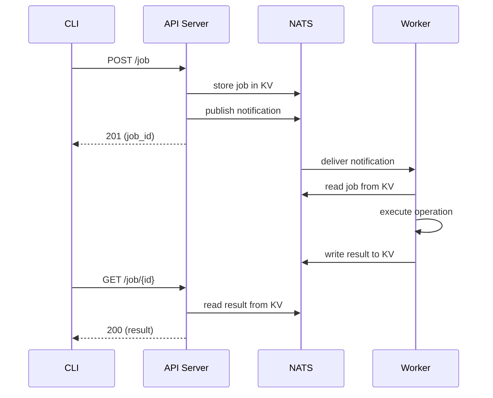
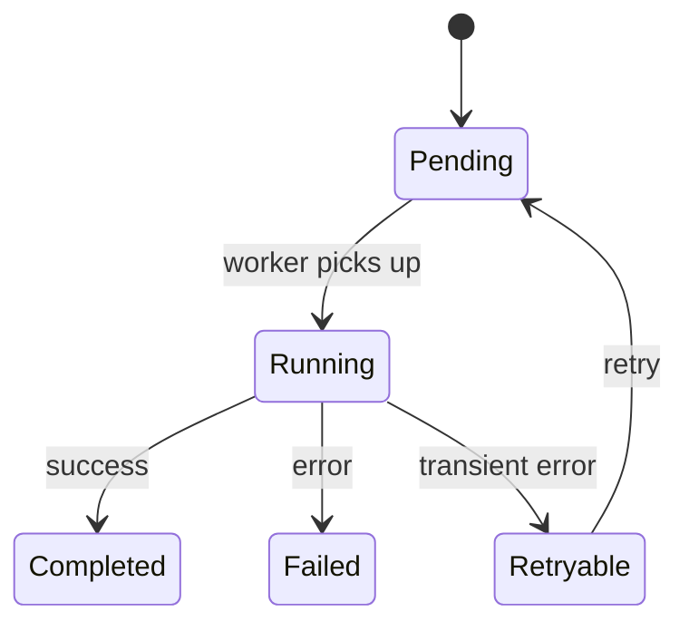

# Job System

The job system is the backbone of OSAPI. Every state-reading or state-changing
operation runs as an asynchronous job, allowing the API server to remain
unprivileged while workers execute operations on target hosts.

## How It Works

OSAPI uses a **KV-first, stream-notification** architecture built on NATS
JetStream:

1. The API server writes a job definition to a NATS KV bucket
2. A notification is published to a NATS stream
3. A worker receives the notification, reads the job from KV, and executes the
   operation
4. The worker writes the result to a response KV bucket
5. The client polls the API server, which reads the result from KV



## Job Routing

Jobs can be targeted to specific workers using routing modes:

| Target        | Behavior                                         |
| ------------- | ------------------------------------------------ |
| `_any`        | Load-balanced across available workers (default) |
| `_all`        | Broadcast to every worker                        |
| `hostname`    | Sent to a specific host                          |
| `group:label` | Sent to all workers matching a label             |

Workers register with their hostname and optional key-value labels. Labels
support hierarchical matching with dot separators (e.g., `group:web.dev` matches
workers with `group: web.dev.us-east`).

## Job Lifecycle

Jobs progress through a defined set of states:



Jobs can be listed, inspected, deleted, and retried through the API and CLI. See
[CLI Reference](../usage/cli/client/job/job.mdx) for usage and examples, or the
[API Reference](/gen/api/job-management-api-job-operations) for the REST
endpoints.

## Configuration

```yaml
nats:
  kv:
    bucket: 'job-queue' # KV bucket for job definitions
    response_bucket: 'job-responses' # KV bucket for results
    ttl: '1h' # Entry time-to-live
    max_bytes: 104857600 # 100 MiB max bucket size

job:
  worker:
    max_jobs: 10 # Max concurrent jobs
    queue_group: 'job-workers' # Queue group for load balancing
    hostname: '' # Defaults to OS hostname
    labels: # Key-value labels for routing
      group: 'web.dev.us-east'
```

See [Configuration](../usage/configuration.md) for the full reference including
NATS stream, consumer, and DLQ settings.

## Permissions

| Operation     | Permission  |
| ------------- | ----------- |
| Create job    | `job:write` |
| List/get jobs | `job:read`  |
| Delete job    | `job:write` |
| Retry job     | `job:write` |

## Related

- [CLI Reference](../usage/cli/client/job/job.mdx) -- job commands
- [API Reference](/gen/api/job-management-api-job-operations) -- REST API
  documentation
- [Job Architecture](../architecture/job-architecture.md) -- KV-first design,
  subject routing, worker pipeline
- [Architecture](../architecture/architecture.md) -- system design overview
