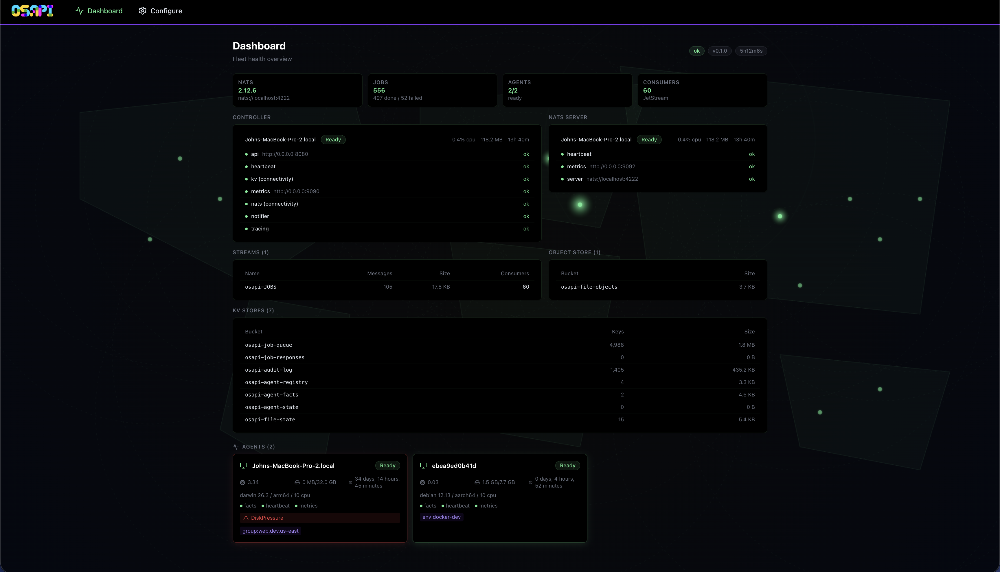
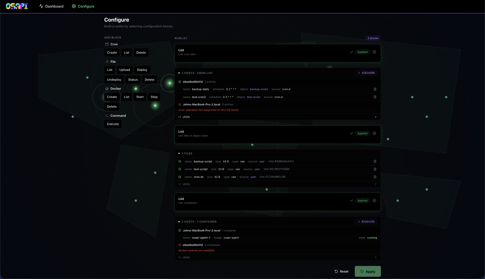

# OSAPI UI

A React management dashboard for [OSAPI][] with a meshtastic-inspired
design language.

## Screenshots

  
  

## ✨ Features

| Feature | Description |
| --- | --- |
| Dashboard | Fleet health with controller/NATS components, streams, KV stores, object store, and agent cards |
| Configure | Block-based operations builder with per-block target selection and result rendering |
| Auth & RBAC | JWT sign-in with role-based permission gating (Admin, Operator, Viewer) |
| Agent Management | Drain/undrain agents from the dashboard with RBAC-gated controls |
| @fact. References | Auto-complete fact references in DNS and network fields from live API |
| Generated SDK | Typed fetch functions from OSAPI's OpenAPI spec via [orval](https://orval.dev/) |

[OSAPI]: https://github.com/osapi-io/osapi

## 🤝 Contributing

See the [Development](docs/development.md) guide for prerequisites, setup,
and conventions. See the [Contributing](docs/contributing.md) guide before
submitting a PR.

## 📄 License

The [MIT][] License.

[MIT]: LICENSE
